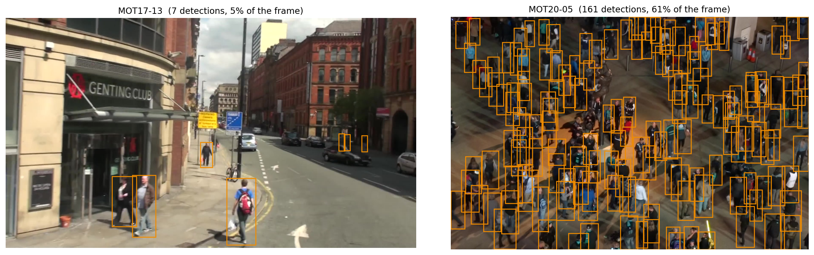
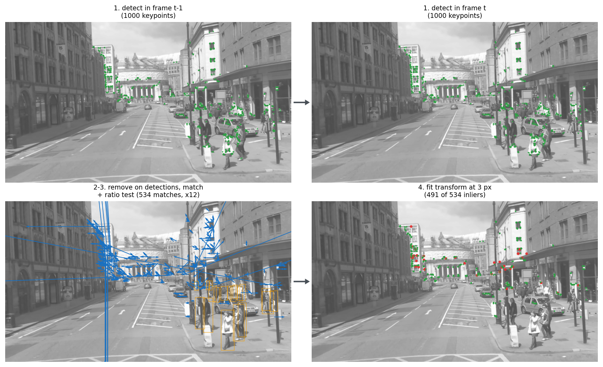
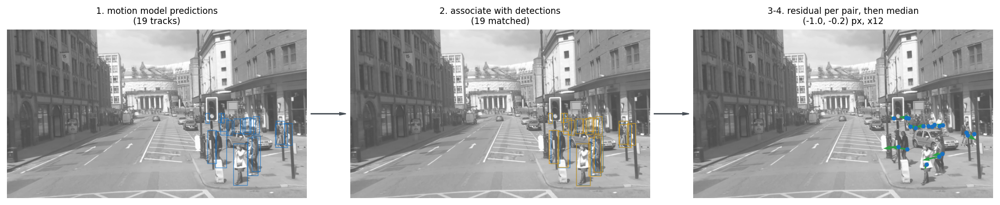

# Camera Motion Compensation for Multi-Object Tracking

*Coursework for the Image Processing course, PhD studies.*

## <a id="sec-1"></a>1. Introduction

Multi-object tracking (MOT) is the task of detecting objects of a given category in a video and
assigning each one an identity that persists across frames. The method that performs this task
is called a tracker. A tracker does not know in advance how many objects will appear, or when
each one enters and leaves the scene. MOT is used in autonomous driving [[1]](#ref-1), sports analysis
[[2]](#ref-2), [[3]](#ref-3), surveillance [[4]](#ref-4), and in retail, robotics and biology [[5]](#ref-5). Many MOT systems follow the
tracking-by-detection paradigm [[6]](#ref-6), [[7]](#ref-7), [[8]](#ref-8), [[9]](#ref-9), [[10]](#ref-10), [[11]](#ref-11), [[12]](#ref-12), [[13]](#ref-13), [[14]](#ref-14): an object
detector produces bounding boxes independently in each frame, and a separate association step
links those boxes across frames into tracks. The two stages are decoupled, so we can replace the
detector without changing the association logic.

SORT [[6]](#ref-6) is the tracking-by-detection pioneer, and the template the rest of this report builds
on. It runs one frame at a time in three steps. First, each track carries a Kalman filter (KF)
[[15]](#ref-15) that predicts the bounding box its object should occupy in the current frame. Second, the
Hungarian algorithm [[16]](#ref-16) matches those predicted boxes to the output of a CNN object detector
([§2.4](#sec-2-4)). Its cost matrix holds the overlap between one prediction and one detection, measured as
intersection over union (IoU). IoU is the area two boxes share divided by the area they cover
together, so it is *1* for boxes with identical coordinates and *0* for boxes that do not touch.
Third, SORT updates the track set: a matched track absorbs its detection as a new measurement,
an unmatched detection starts a track, and a track left unmatched for a set number of frames is
deleted.

The Kalman filter used by SORT and by most of its descendants [[7]](#ref-7), [[8]](#ref-8), [[9]](#ref-9), [[10]](#ref-10), [[11]](#ref-11), [[12]](#ref-12),
[[13]](#ref-13) assumes constant velocity: an object's position advances linearly from frame to frame. That
is a valid assumption for pedestrian tracking, where people move at close to a steady speed over
the interval between two frames. Unfortunately, camera motion breaks it. The tracker predicts in
image coordinates, and camera motion moves that coordinate system relative to the scene. A
stationary point therefore lands at a different image location in the next frame, and every
predicted box is displaced by the camera's motion on top of the object's own. The motion model
is not aware of this. It sees the displacement only afterwards, as prediction error. The
velocity estimate then absorbs part of that error and over-corrects on the next frame. Meanwhile
the predicted boxes drift off their objects, IoU falls, association fails, and identities
switch. The effect is most problematic for trackers that rely on motion alone, which is the case
for SORT.

One way to mitigate this is to replace the Kalman filter with a motion model that can represent
non-linear motion, provided that motion is predictable from the trajectory history. Learned
filters do this [[14]](#ref-14), [[17]](#ref-17), [[18]](#ref-18): rather than assuming a motion law, they learn from data how
objects in the domain actually move, so they can model non-linear motion that a
constant-velocity assumption cannot, including the drift a steady camera pan adds to every
trajectory in the scene. However, they cannot handle *unpredictable* camera motion. For example,
hand shake is close to random from one frame to the next, and a gust of wind or an abrupt change
of direction leaves no trace in the trajectory history before it happens. No motion model can
recover such motion from trajectories alone. Camera motion is visible only in the image content,
so estimating it means comparing consecutive frames directly. This is an image registration
problem, and the component that solves it inside a tracker is called camera motion compensation
(CMC). Removing the camera's contribution restores the condition the motion model assumes, which
for the Kalman filter used here is constant velocity: once we compensate for the camera, object
motion in image coordinates is again approximately linear.

In this work, we implement methods from three families of CMC and measure them on the validation
splits of MOT17 [[19]](#ref-19) and MOT20 [[4]](#ref-4):

- **Keypoints tracked by optical flow** ([§3.1](#sec-3-1)). Points are selected in the previous frame and
  located in the current one by following their local image neighbourhood. The pairing comes
  from the flow estimate itself, so no descriptor is needed, but the search assumes the point
  moved only a short distance.
- **Keypoints matched by descriptor** ([§3.2](#sec-3-2)). Keypoints are detected in both frames
  independently, each described by a vector summarising its surrounding patch, and pairs are
  formed by matching those descriptors. Nothing constrains how far a point may have moved, so
  larger camera motion is handled, at the cost of pairing regions that only look alike.
- **Motion-Residual CMC** (MR-CMC, [§3.4](#sec-3-4)), which we propose here. The offset between each track's
  predicted box and the detection matched to it is taken as a point pair. No image data is read,
  so the cost is one association pass per frame. What it corrects is the global error in the
  motion model's predictions rather than camera motion specifically ([§4.4.2](#sec-4-4-2)).

We also investigate YOLO masking ([§3.3](#sec-3-3)) as an enhancement to the first two families. Before
fitting the transformation we drop the features that fall on a detected object, since those
objects move independently of the camera.

We draw four conclusions from the experimental analysis:

1. CMC improves tracking accuracy on sequences with camera motion, at the cost of throughput.
   On SORT the gain is *+0.94* to *+1.22* accuracy points, and it comes entirely from
   improved association; it holds on three other trackers too, from *+0.56* to *+1.34*
   over sixteen tracker and CMC combinations ([Appendix B.4](#sec-b-4)). The image-based methods
   reduce throughput from *191.6* to between *2.7* and *38.7* frames per second.
2. The three families differ mostly in cost: their accuracy spread is smaller than the variation
   between repeated runs. Choosing between them is therefore a throughput decision, and
   answering it means separating each method's cost from our implementation of it. With OpenCV's
   routines in place of ours, optical flow and ORB cost *5.0×* and *5.8×* the uncompensated tracker
   while SIFT still costs *71×*, and MR-CMC costs *1.2×* with either implementation, since it reads
   no image data.
3. YOLO masking produces no relevant accuracy benefit, and it speeds up our custom Python
   implementations but not OpenCV's. Masking removes keypoints, and the more of the frame the
   detections cover, the more it removes: with our NumPy code the smaller feature set takes
   optical flow from *5.7* to *8.4* frames per second, while with OpenCV's routines the same
   comparison is a small loss. On accuracy it helps where detections cover little of the frame,
   averages to zero across MOT17, and does harm in crowded scenes, where too few keypoints
   survive.
4. MR-CMC is a simple and surprisingly efficient method. It reads no image data, yet recovers
   *77%* of the gain the best image-based method achieves: *+0.94* against *+1.22* accuracy points
   over the uncompensated baseline. It costs *1.2×* the uncompensated tracker's runtime, against
   *5.0×* to *71×* for the image-based families. On this evidence it is a candidate replacement for
   them when throughput matters, though what it corrects is the global prediction error rather
   than camera motion ([§4.4.2](#sec-4-4-2)).

---

## <a id="sec-2"></a>2. Background

This section covers what the rest of the report assumes. [§2.1](#sec-2-1) introduces the four trackers we
measure the compensation on and the metrics we report. [§2.2](#sec-2-2) describes what a camera motion
compensator computes and how its output combines with the motion model. [§2.3](#sec-2-3) covers the keypoint
algorithms the compensators are built from, and [§2.4](#sec-2-4) the object detector whose output drives
masking.

### <a id="sec-2-1"></a>2.1 Tracker overview

We use four trackers from the literature for the experimental analysis. Each of them predicts
with a Kalman filter, so they differ only in how they associate. All three of the others derive
from SORT: ByteTrack and MoveSORT-KF extend it directly, and SparseTrack extends ByteTrack.

SORT [[6]](#ref-6), as described in [§1](#sec-1), is the simplest of the four, which is why we use it as the primary
backbone in [§4](#sec-4).


ByteTrack [[8]](#ref-8) extends SORT by splitting detections into high-score and low-score groups and
associating in two passes. The second pass recovers occluded objects whose detection confidence
dropped, which a single threshold would discard.

SparseTrack [[11]](#ref-11) extends ByteTrack by adding pseudo-depth binning to its two-stage matching. It
groups detections by an estimate of depth and matches group by group from near to far, which
separates overlapping objects in crowded scenes.

MoveSORT-KF [[13]](#ref-13) extends SORT by replacing its IoU cost with a combination of IoU and an L1
distance between predicted and detected box coordinates. The `-KF` suffix marks the
Kalman-filter variant; the same work also proposes learned filters, which we do not use here.

**Metrics.** We compute all metrics with
[TrackEval](https://github.com/JonathonLuiten/TrackEval), the reference implementation. We focus
on two: HOTA for tracking accuracy and FPS for throughput. HOTA [[20]](#ref-20) is the
geometric mean of detection accuracy and association accuracy, so a single number reflects both.
FPS is the throughput of the tracker and CMC together, measured with detections read from
cache, which isolates the cost of the camera compensation. The remaining columns support those two. 
DetA and AssA are the two factors inside HOTA: DetA
measures how well the predicted boxes match the ground-truth boxes ignoring identity, and AssA
measures how consistently one ground-truth identity is covered by a single track over its
lifetime. MOTA [[21]](#ref-21) combines false positives, false negatives and identity switches, and
responds mostly to detection quality. IDF1 [[22]](#ref-22) is an identity F1 under a one-to-one matching
between predicted and ground-truth tracks, and responds mostly to association quality. IDSW
counts how many times a predicted track changes its assigned ground-truth identity.

### <a id="sec-2-2"></a>2.2 Camera motion compensation

A CMC method estimates camera motion by comparing image content between the previous and the
current frame. It extracts features from both, matches them against each other, and fits a
geometric transformation to the resulting point pairs. The output is a transformation from the
coordinate system of the previous frame to that of the current frame. The tracker applies it to
the motion model's predictions, so that association compares detections against predictions
expressed in the current frame's coordinates. The transformation used throughout this report is
affine: a linear map plus a translation, covering translation, rotation, scale and shear.
Between consecutive frames at the [[19]](#ref-19) frame rates of *25* to *30* frames per second camera motion
is small, and an affine map approximates it closely.

The CMC transformation affects the whole image, so we have to align the coordinate system of the
motion model with it, not only the box it predicted. A Kalman filter keeps a recursive state per
track, so we transform that state for every track, including the ones that went unmatched in
this frame. Correcting the state rather than the predicted box alone means the correction
carries into later predictions, and a track that receives no detection stays aligned with the
scene while it is lost.

### <a id="sec-2-3"></a>2.3 Keypoint detection and matching

Every CMC method in [§3](#sec-3) reduces to two steps: produce point pairs between two frames, then fit a
transformation to them. The methods differ in how they produce the point pairs. This section
describes the algorithms used in this report.

#### <a id="sec-2-3-1"></a>2.3.1 Shi-Tomasi corner detection

A CMC method needs points it can locate again in the next frame. Inside a uniform region a small
window looks the same wherever it is placed, so its displacement cannot be recovered at all.
Along a straight edge the displacement across the edge is recoverable, but sliding the window
along the edge changes nothing, so displacement in that direction is not. A corner resolves both
directions at once: it has structure running two different ways, so no shift leaves the window
looking as it did.

Shi and Tomasi [[23]](#ref-23) turn that three-way distinction, between a flat region, an edge and a
corner, into a single number. Each location is summarised by a small matrix built from the local
image gradients. Its two eigenvalues measure how much the window changes when shifted along two
perpendicular directions. Their score is the smaller of the two eigenvalues, so it is high only
where a shift either way is visible: low on flat regions and edges, high on corners. The
detector keeps locations whose score exceeds a fraction of the largest score in the image,
suppresses non-maximal responses, and enforces a minimum spacing so the selected points spread
over the frame.


The dark regions contain few detected corners, not because they are dark, but because they have
little local intensity variation. Shi–Tomasi selects points with strong changes in intensity in
multiple directions, so flat or weakly textured areas receive low scores and are not selected.

Shi-Tomasi returns point locations without any description of what is at them. Corners are still
good features to follow, which is what the optical flow of the next section does with them, and
that pairing is the one place where a bare location is enough.

#### <a id="sec-2-3-2"></a>2.3.2 Pyramidal Lucas-Kanade optical flow

Lucas-Kanade [[24]](#ref-24) estimates where a given point moved between two frames, and the pyramidal
formulation of Bouguet [[25]](#ref-25) extends it to larger camera motion (pseudo-code in [Appendix
A.3](#sec-a-3)). The method is based on constant intensity assumption: a small window around the
point keeps its appearance as it moves, so for a displacement `(u, v)` between consecutive
frames,

```
I(x, y, t) ≈ I(x + u, y + v, t + 1)        for every pixel (x, y) in the window
```

Expanding the right-hand side about `(x, y, t)` to first order,

```
I(x + u, y + v, t + 1) ≈ I(x, y, t) + u·Ix + v·Iy + It
```

where `Ix`, `Iy` and `It` are the image derivatives in `x`, `y` and time. Substituting this back
cancels `I(x, y, t)` and leaves the constraint the method solves,

```
u·Ix + v·Iy + It ≈ 0
```

One equation cannot fix two unknowns, so every pixel in the window supplies one and the system
is solved in the least-squares sense, iterating around the current estimate. The first-order
expansion is valid only for displacements of about a pixel. Larger motion is handled by building
an image pyramid and solving coarse-to-fine: at a level downsampled by `2^k` the same physical
motion spans `2^k` times fewer pixels, so it falls inside the valid range. The estimate from
each level initialises the level below.

Optical flow returns one point pair per followed feature: the point in the previous frame and
the location it moved to. Each pair is a translation of a single point, which is not yet a
transformation of the frame. The affine transformation is fitted over all the pairs at once by
the outlier-robust estimator of the next section.

#### <a id="sec-2-3-3"></a>2.3.3 RANSAC

Point matches contain errors. A descriptor matcher pairs regions that look alike but are not the
same location, and any point pair on a moving object describes that object's motion rather than
the camera's. A least-squares fit is influenced by every pair it is given, so a minority of
outliers drags the estimate away from the right answer.

RANSAC [[26]](#ref-26) fits the transformation from repeated minimal samples instead (pseudo-code in
[Appendix A.4](#sec-a-4)). Three point pairs determine an affine transformation exactly. The
transformation a sample implies is scored by how many of the remaining pairs it predicts to
within a residual threshold; the best-supported sample is kept, and the transformation is refit
over all the pairs supporting it. The method assumes the correct pairs form the largest
self-consistent group, so it fails when the outliers agree with each other, which [§4.4.3](#sec-4-4-3) shows
happening in crowded scenes.

The figure below shows the two estimators on a line fit: a handful of points off the line pulls
least squares away from the data, while RANSAC recovers the line from the subset that agrees.


The estimator takes the point pairs from any of the three families and returns the affine
transformation the tracker applies, which is the step [§2.3.2](#sec-2-3-2) deferred.

#### <a id="sec-2-3-4"></a>2.3.4 ORB

ORB [[27]](#ref-27) detects keypoints and computes a descriptor for each, so that keypoints found
independently in two frames can be paired (pseudo-code in [Appendix A.1](#sec-a-1)).

Detection uses the FAST corner test [[28]](#ref-28) on each level of an image pyramid: a pixel is a corner
if a long enough contiguous arc of the 16 pixels on a circle around it is uniformly brighter or
darker than the centre. ORB ranks the survivors by Harris corner score [[29]](#ref-29) and keeps the
strongest, then assigns each keypoint an orientation from the intensity centroid of its
surrounding patch.

The descriptor is BRIEF [[30]](#ref-30): a fixed set of 256 pixel pairs within the patch, rotated by the
keypoint's orientation, each contributing one bit according to which of the two pixels is
brighter. The result is a 256-bit string, compared between keypoints by Hamming distance.


#### <a id="sec-2-3-5"></a>2.3.5 SIFT

SIFT [[31]](#ref-31) detects keypoints and computes a descriptor for each so that the same structure
matches across frames even after it has moved, rotated or changed size (pseudo-code in
[Appendix A.2](#sec-a-2)). Lowe reports invariance to scale and rotation, and robustness to changes in
illumination and to moderate changes in viewpoint.

The structure SIFT looks for is a blob, a region that differs from its surroundings over some
extent, rather than a corner defined at a single pixel. Blobs suit a scale search because a blob
has a natural size, and they are plentiful in the kind of texture a corner detector responds to
weakly. The detector finds them with a difference of Gaussians (DoG): the image is blurred at
progressively larger scales and neighbouring blur levels are subtracted, which responds most
strongly where a region stands out at the scale separating the two levels.

A candidate keypoint is a point larger or smaller than every neighbour in the resulting stack,
taken across position and scale, so it arrives with the scale it was found at. Candidates with
too little contrast are discarded, as are those lying along an edge rather than on a blob
([Appendix A.2](#sec-a-2) gives the test).

Each keypoint gets an orientation from a histogram of local gradient directions, which is what
makes the descriptor invariant to rotation. The descriptor divides a *16×16* neighbourhood,
rotated to that orientation, into a *4×4* grid, builds an 8-bin gradient orientation histogram per
cell, and concatenates them into 128 normalised values. Descriptors are compared by Euclidean
distance.


SIFT descriptors are larger and slower to compute than ORB's, and they discriminate better,
which [§4.4.3](#sec-4-4-3) shows has consequences when few keypoints are available.

### <a id="sec-2-4"></a>2.4 YOLO object detection

Tracking-by-detection starts by detecting the objects in each frame, so every tracker here runs
on an object detector. A tracker's accuracy and speed are bound by the detector's quality and
speed ([§4.3](#sec-4-3)). We also need it for feature masking ([§3.3](#sec-3-3)).

YOLO [[32]](#ref-32) detects objects in a single forward pass. It divides the image into a grid and
predicts box coordinates and class scores for each cell directly. The two-stage detectors that
preceded it, such as Faster R-CNN [[33]](#ref-33), generate region proposals and then classify each one in
a second pass over hundreds of regions per image. Dropping that second pass is what makes YOLO
fast: detection becomes one convolutional forward pass whose cost does not depend on how many
objects are present.

YOLOX [[34]](#ref-34) differs from earlier YOLO versions in two ways that matter for detection quality. It
is anchor-free: it regresses box sizes directly instead of as offsets from a set of predefined
anchor shapes, which removes anchor tuning as a dataset-specific step. And it uses a decoupled
head: separate branches compute classification and box regression, since the two tasks favour
different features. [§4.2](#sec-4-2) gives the variant and checkpoint we use.



---

## <a id="sec-3"></a>3. CMC Methodology

The three CMC method families that we experimented with share one structure: produce point pairs
between the previous and the current frame, then fit an affine transformation to them. They
mainly differ in how the keypoints are extracted and how they are matched between the two
frames. That choice sets both the cost per frame, which varies by more than an order of
magnitude, and the conditions under which the estimate degrades. YOLO masking ([§3.3](#sec-3-3)) is our
proposed extension to those algorithms rather than a family of its own: it filters the point
pairs that [§3.1](#sec-3-1) and [§3.2](#sec-3-2) produce.

### <a id="sec-3-1"></a>3.1 Keypoints tracked by optical flow

Optical flow produces point pairs without requiring any feature descriptors. A point is selected in the
previous frame, and the algorithm searches the corresponding neighbourhood of the current frame
for the place that looks the same. The pair is the point and the place it was found, so any
detector that returns locations can supply the input.

1. **Detect features in the previous frame.** Shi-Tomasi is the default algorithm, for the reason
   given in [§2.3.2](#sec-2-3-2), with ORB and SIFT as alternatives. In this role only the keypoint
   coordinates are used and the descriptors are discarded.
2. **Remove features lying on a detected object** (optional, [§3.3](#sec-3-3)).
3. **Follow each feature into the current frame** with pyramidal Lucas-Kanade
   ([§2.3.2](#sec-2-3-2)), and discard the ones whose linear system is too poorly conditioned to
   determine a displacement.
4. **Fit the affine transformation** to the surviving point pairs with RANSAC ([§2.3.3](#sec-2-3-3)).


The number of features requested sets the cost, since optical flow is linear in the number of
points and dominates the per-frame time of this method. We use the same number as BoT-SORT [[9]](#ref-9)
([§4.2](#sec-4-2)).

### <a id="sec-3-2"></a>3.2 Keypoints matched by descriptor

Matching detects features in both frames independently and pairs them by local appearance. It
makes no assumption that a feature moved only a short distance, so it handles larger camera
motion than optical flow. It can also pair regions that look alike without being the same
location, which optical flow cannot do.

1. **Detect features and descriptors in both frames**, which requires a detector that produces
   descriptors (e.g. ORB or SIFT).
2. **Remove features lying on a detected object, in both frames** (optional, [§3.3](#sec-3-3)).
   Removing them from one frame only would leave the surviving features in the other frame free to
   match against background features, producing exactly the point pairs the removal was meant to
   prevent.
3. **For each descriptor in the previous frame, find its two nearest in the current frame**, under
   the norm the detector defines (e.g. Hamming distance for ORB's binary strings, Euclidean
   distance for SIFT's float vectors).
4. **Apply Lowe's ratio test**, keeping a match only when the nearest descriptor is closer than a
   fixed fraction of the distance to the second nearest ([§4.2](#sec-4-2)).
5. **Reject implausible displacements** (optional). A displacement larger than a quarter of the
   frame cannot be camera motion between consecutive frames. This stage is measured in
   [Appendix B.3](#sec-b-3).
6. **Fit the affine transformation** with RANSAC ([§2.3.3](#sec-2-3-3)).

Steps 4 and 5 are taken from BoT-SORT's [[9]](#ref-9) CMC implementation.



Lowe's ratio test and YOLO masking both remove point pairs that would mislead the estimator, and
they target different causes. The ratio test removes *uncertain* pairs, where the descriptor
matches several locations about equally well. Masking removes pairs that are *reliable but
irrelevant*: a well-matched point on a pedestrian describes the pedestrian's motion accurately,
and that motion is not the camera's.

### <a id="sec-3-3"></a>3.3 Masking non-static background with YOLO

We estimate camera motion from the static parts of the scene. A point pair on a pedestrian
carries that pedestrian's motion, and the estimator has no way to tell the two apart. RANSAC
removes such pairs when they disagree with each other, but several people walking in the same
direction produce point pairs that agree, which is the case RANSAC handles worst.

The object detector already locates the moving objects, and this is the second reason it matters
to CMC: its output marks where the point pairs that would pull the estimate toward object motion
are. Masking uses that output to keep features off them, and applies to [§3.1](#sec-3-1) and [§3.2](#sec-3-2) in the
same way, as a filter between feature detection and pair formation:

1. Expand each detection box by a fixed factor ([§4.2](#sec-4-2)). A box rarely covers the whole
   object, and a feature just outside one often still sits on it, particularly where motion blur
   extends the object's apparent extent.
2. Discard every detected feature inside an expanded box.
3. Continue with the remaining features.

For optical flow we apply the filter in the previous frame, which is where the features are
selected. For descriptor matching we apply it in both frames, for the reason given in [§3.2](#sec-3-2).

The filter removes points rather than painting the boxes out of the image, because filling a box
introduces a step edge that corner and blob detectors respond to, which would reintroduce at the
object's outline the very pairs masking is meant to remove ([Appendix B.6](#sec-b-6) measures
both).


Masking inherits the detector's blind spots. It can only mask what the detector reports, so any
moving object outside the detector's classes, or missed by it, still contributes point pairs.
The static-scene assumption therefore holds only as far as the detector's coverage of the
non-static objects in the scene.

### <a id="sec-3-4"></a>3.4 Motion-Residual CMC (MR-CMC)

We propose a simple method that attempts to estimate camera motion without using image features,
hence being very compute efficient. The methods above spend most of their per-frame cost on
image processing. MR-CMC instead uses the residual between a motion model's prediction and the
detection matched to it. It is independent of the motion model used, since it needs only
per-track predictions. Here we consider the Kalman filter that SORT and its
descendants use, and the implementation is registered as `kf-residual` (pseudo-code in
[Appendix A.5](#sec-a-5)).

The motion model already predicts where each tracked object should appear. That prediction
extrapolates the object's own velocity and contains no information about the camera, so it
describes where the object would be if the camera had not moved. The detection matched to it
shows where the object actually appears. If the motion model were exact, the offset between the
two would be the camera motion alone. In practice the model is not exact, so the offset also
carries whatever it got wrong about the object.

1. **Take the motion model's predictions** for the current frame, and the current detections above
   a confidence threshold.
2. **Associate predictions with detections** using the tracker's own IoU association. The
   threshold is deliberately high ([§4.2](#sec-4-2)), so uncertain matches are dropped rather than
   contributing a point pair whose residual means nothing.
3. **Form one point pair per matched pair**: the predicted box centre and the detected box centre.
4. **Fit the transformation.** Either a translation, taken as the median displacement over the
   point pairs, or a full affine transformation fitted with RANSAC ([§4.4.2](#sec-4-4-2) measures
   both).



Step 4 is constrained by how many point pairs exist: one per tracked object, which on MOT17's
moving sequences is *8* to *18* per frame against roughly *1000* for a feature detector. Six affine
parameters from ten noisy box centres leave almost no redundancy, whereas a translation has two
parameters and a median that tolerates up to half the pairs being wrong.

Three limitations follow. The method is coupled to association, since it estimates from matches
made with uncompensated predictions, so it degrades exactly as camera motion grows, which is
when compensation matters most. It needs objects in the frame, since a scene with no tracked
objects yields no point pairs at all; masking ([§3.3](#sec-3-3)) correspondingly does not apply, because the
motion model has already removed the object motion that masking exists to remove. And the
residual carries whatever else the motion model gets wrong, so what the method corrects is the
shared component of prediction error rather than camera motion specifically ([§4.4.2](#sec-4-4-2)).

---

## <a id="sec-4"></a>4. Experimental Analysis

[§4.1](#sec-4-1) describes the two datasets, [§4.2](#sec-4-2) the experimental setup, and [§4.3](#sec-4-3) the main results. [§4.4](#sec-4-4)
isolates which parts of the pipeline the result comes from and examines the two methods whose
behaviour the main table leaves unexplained.

### <a id="sec-4-1"></a>4.1 Datasets

We run the main comparison on MOT17 [[19]](#ref-19), because four of its seven validation sequences are
filmed from a moving camera and MOT17-13 from a moving car. It publishes no validation split, so
we take the second half of each training sequence, following ByteTrack [[8]](#ref-8) and BoT-SORT [[9]](#ref-9); the
checkpoint is trained on the first halves and has not seen the evaluated frames. We keep one of
the three per-detector copies, which differ only in public detections we do not use, giving *7*
sequences and *2659* frames.

MOT20 [[4]](#ref-4) is filmed with static cameras and is far more crowded: *50* to *192* boxes per frame
against MOT17's *8* to *46*. It serves as a control, since with no camera motion a compensation
method should leave accuracy unchanged, and its detection density tests masking at coverage
MOT17 does not reach. Its validation split is built the same way: *4* sequences, *4467* frames.

### <a id="sec-4-2"></a>4.2 Experimental setup

**Detector.** YOLOX-X [[34]](#ref-34) with the checkpoints released alongside ByteTrack [[8]](#ref-8). Detections
are computed once per dataset and cached, so throughput measures the tracker and the
compensation only and no run is affected by detector non-determinism. The checkpoints cover the
pedestrian class only, which bounds what masking can remove ([§3.3](#sec-3-3)): vehicles are never detected
and so never masked.

**Tracker.** All results use SORT unless stated otherwise: it is the simplest of the four trackers
in [§2.1](#sec-2-1), so a change in accuracy is least confounded by recovery machinery of its own.
[Appendix B.4](#sec-b-4) repeats the comparison on ByteTrack, MoveSORT-KF and SparseTrack. Each is taken as
published with nothing re-tuned, and within a table every run shares tracker hyper-parameters,
so the CMC method is the only difference between rows.

**CMC parameters.** Frames are processed at a *960* pixel long edge, which bounds the cost of the
image-based methods without measurably affecting the estimate. Feature detectors request *1000*
features and Lowe's ratio test ([§3.2](#sec-3-2)) uses *0.9*, both following BoT-SORT [[9]](#ref-9), where Lowe's
original paper suggests *0.8*. Masking ([§3.3](#sec-3-3)) expands each detection box by *20%*. MR-CMC ([§3.4](#sec-3-4))
associates at IoU *0.30* over detections above confidence *0.6*. RANSAC uses a *3.0* px residual
threshold and *500* iterations. [Appendix C](#sec-c) lists every default.

**Hardware and software.** Intel Core i7-12700K, NVIDIA GeForce RTX 3070. OpenCV `4.11.0`, NumPy `<2.0`, Python *3.11*, single-threaded. Seed *42*.

### <a id="sec-4-3"></a>4.3 Main results

Each row names a method family from [§3](#sec-3). Masking ([§3.3](#sec-3-3)) has no row of its own, since it is an
extension rather than a family: it appears as the `+ masking` variant of the two families it
applies to.

#### MOT17-val

| variant | HOTA | AssA | DetA | IDF1 | MOTA | IDSW | ΔHOTA | assoc FPS |
|---|---:|---:|---:|---:|---:|---:|---:|---:|
| no CMC (baseline) | 61.31 | 64.32 | 58.97 | 71.61 | 64.11 | 275 | – | **191.6** |
| BoT-SORT cache | 62.45 | 66.42 | **59.23** | 73.76 | **64.63** | 186 | +1.15 | n/a |
| Shi-Tomasi + LK | 62.32 | 66.18 | 59.18 | 73.55 | 64.59 | 194 | +1.01 | 38.7 |
| Shi-Tomasi + LK + masking | **62.91** | **67.46** | 59.17 | **74.58** | 64.58 | **185** | **+1.61** | 38.0 |
| ORB matching | 62.57 | 66.68 | 59.22 | 73.98 | 64.61 | 191 | +1.27 | 33.0 |
| ORB matching + masking | 62.42 | 66.39 | 59.20 | 73.38 | 64.48 | 211 | +1.11 | 32.0 |
| SIFT matching | 62.19 | 65.92 | 59.19 | 73.48 | 64.60 | 191 | +0.88 | 2.7 |
| SIFT matching + masking | 62.53 | 66.73 | 59.10 | 74.15 | 64.56 | 191 | +1.23 | 2.8 |
| MR-CMC | 62.25 | 66.07 | 59.15 | 73.65 | 64.58 | 200 | +0.94 | 163.7 |

The BoT-SORT cache row replays the transformations BoT-SORT published for these sequences, read
from file rather than estimated here. Its throughput is not comparable with the other rows,
since the transformations were computed offline, so its FPS is reported as `n/a`; the row is a
reference point for accuracy.

Based on the results, we draw four conclusions.

- CMC improves tracking accuracy, and the improvement is confined to association. Every method
  gains between *+0.94* and *+1.22* HOTA over the baseline. Across the table DetA spans *0.26* while
  AssA spans *2.52*, and identity switches fall from *275* to *188*.
- The three families reach the same accuracy, but differ in cost. Shi-Tomasi with optical flow,
  ORB matching and SIFT matching land within *0.15* HOTA of each other and within *0.20* of
  BoT-SORT's published transformations. Against the uncompensated tracker's *191.6* FPS they cost
  *16×* (ORB), *34×* (optical flow) and *80×* (SIFT) with custom Python implementations, and *5.8×*,
  *5.0×* and *71×* with OpenCV's routines in place of ours.
- Masking adds a small accuracy gain, and it speeds up only our Python code. Each method gains
  between *+0.12* and *+0.28* HOTA. Optical flow rises from *5.7* to *8.4* FPS with our NumPy code, but
  falls from *38.7* to *38.0* with OpenCV's.
- MR-CMC reaches comparable accuracy without processing images. At *62.25* HOTA it is within *0.27*
  of the best method, and it runs at *163.7* FPS against the uncompensated tracker's *191.6*, a
  slowdown of *1.2×* where the image-based methods cost *16×* to *80×*.

Our custom Python implementations of pyramidal Lucas-Kanade, descriptor matching and RANSAC,
compared with the OpenCV routines they replace. Keypoint detection and descriptor computation
are OpenCV's in both cases.

| variant | HOTA, ours | HOTA, OpenCV | FPS, ours | FPS, OpenCV | cost vs no CMC |
|---|---:|---:|---:|---:|---:|
| Shi-Tomasi + LK | 62.26 | 62.32 | 5.7 | **38.7** | 34× → **5.0×** |
| Shi-Tomasi + LK + masking | 62.52 | 62.91 | 8.4 | **38.0** | 23× → **5.0×** |
| ORB matching | 62.40 | 62.57 | 12.1 | **33.0** | 16× → **5.8×** |
| ORB matching + masking | 62.52 | 62.42 | 12.9 | **32.0** | 15× → **6.0×** |
| SIFT matching | 62.25 | 62.19 | 2.4 | 2.7 | 80× → **71×** |
| SIFT matching + masking | 62.53 | 62.53 | 2.4 | 2.8 | 80× → **68×** |

#### MOT20-val

We use MOT20 to verify that CMC does not reduce tracking accuracy on datasets filmed with static
cameras.

| variant | HOTA | AssA | DetA | IDF1 | MOTA | IDSW | ΔHOTA | assoc FPS |
|---|---:|---:|---:|---:|---:|---:|---:|---:|
| no CMC (baseline) | 53.30 | 52.66 | 54.11 | 68.41 | 66.86 | 1450 | – | **43.9** |
| Shi-Tomasi + LK | 53.32 | **52.71** | 54.11 | 68.44 | **66.88** | **1405** | +0.02 | 22.7 |
| Shi-Tomasi + LK + masking | 53.15 | 52.37 | 54.12 | 68.14 | 66.87 | 1434 | −0.14 | 23.4 |
| ORB matching | 53.11 | 52.32 | 54.09 | 68.07 | 66.85 | 1445 | −0.18 | 18.6 |
| ORB matching + masking | 47.92 | 42.82 | 53.80 | 59.01 | 66.40 | 2829 | **−5.38** | 17.1 |
| SIFT matching | 53.25 | 52.56 | 54.12 | 68.37 | 66.87 | 1427 | −0.05 | 2.9 |
| SIFT matching + masking | 53.15 | 52.39 | 54.09 | 68.19 | 66.86 | 1443 | −0.15 | 2.9 |
| MR-CMC | **53.33** | 52.70 | **54.14** | **68.48** | 66.87 | 1424 | **+0.03** | 34.9 |

CMC does not reduce performance on static scenes: every method lands within *0.21* HOTA of the
baseline, the one exception being ORB matching with masking, which [§4.4.3](#sec-4-4-3) examines.

### <a id="sec-4-4"></a>4.4 Ablation study and qualitative analysis

All measurements in this section use MOT17-val with SORT unless stated otherwise, so the rows
are directly comparable.

#### <a id="sec-4-4-1"></a>4.4.1 Which stage produces the gain

Enabling the ORB pipeline's three stages one at a time isolates which of them produces its *+1.21*
HOTA: forming the point pairs, fitting them with RANSAC rather than least squares over every
pair, and removing the pairs that lie on detected objects.

| point pairs | robust fit | masking | HOTA | contribution |
|:---:|:---:|:---:|---:|---:|
| ✗ | ✗ | ✗ | 61.31 | baseline |
| ✓ | ✗ (least squares) | ✗ | 61.33 | +0.02 |
| ✓ | ✓ (RANSAC) | ✗ | 62.26 | +0.93 |
| ✓ | ✓ (RANSAC) | ✓ | 62.52 | +0.26 |

Based on the results, we conclude that robust estimation is where the gain comes from. Least
squares over every pair yields only *+0.02*, and that flat total hides two large cancelling
effects: on half the moving sequences the unrobust variant scores several HOTA below the no-CMC
baseline, because outlier pairs drag the fit far enough that compensating is worse than not.
RANSAC recovers *+0.93* of the *+1.21* total, leaving masking's *+0.26* below the seed-to-seed noise
floor of *0.354* HOTA ([Appendix B.3](#sec-b-3)).

#### <a id="sec-4-4-2"></a>4.4.2 Motion-Residual CMC

Camera motion displaces every prediction in the same direction and by the same amount, so the
residual between a prediction and its matched detection carries a component shared across all
tracked objects. [§3.4](#sec-3-4) offers two ways to turn those residuals into a transformation:

| model | statistic | points per object | HOTA | IDSW |
|---|---|---|---:|---:|
| affine, 6 parameters | RANSAC | corners | 61.47 | 265 |
| translation, 2 parameters | median | corners | 62.10 | 197 |
| translation, 2 parameters | median | centre | **62.25** | 200 |
| translation, 2 parameters | mean | centre | 62.06 | 212 |

The affine fit gains only *+0.16* HOTA and raises identity switches above both translation variants:
six parameters from *8* to *18* point pairs leave no redundancy, so one bad association moves the
transformation. The remaining variants land within the noise floor of the default.
Box corners add no information over the centre, since an axis-aligned box's corners follow from
its centre and size, and the mean is less robust than the median to the few residuals that are
wrong, which the identity switches register even where HOTA cannot.

Analysing performance per scene exposes a limitation. The method improves tracking on static
scenes, where there is no camera motion to compensate, gaining *+3.21* HOTA on one such sequence
while every other working method returns the baseline exactly. **This suggests that the method
does not compensate camera motion but the global error in the motion model's predictions**, of
which camera motion is only one source: on a crowded static scene, pedestrians walking at a
consistent pace are mispredicted in the same direction, and the median extracts the common
error. The gain therefore cannot be credited to camera motion compensation, and the method is
better read as a heuristic for association.

#### <a id="sec-4-4-3"></a>4.4.3 Qualitative analysis

The figures below examine visually how each method behaves on real scenes, each one produced by
the same code the experiments ran.

**RANSAC outlier removal.** Colouring the ORB matches on a MOT17-13 frame pair by the estimator's
verdict shows which ones RANSAC discards, and whether those are the ones that would have misled
the fit:


Of *824* matches, *763* are accepted. The rejected *61* are descriptor confusions across the
repetitive building facade: individually plausible in appearance, and geometrically inconsistent
with any single camera motion. The accepted set is dominated by the background, which is the
population the transformation should be fitted to.

**Compensation applied to the frame.** The panels difference the two frames before and after the
previous frame is transformed into the current one, so anything still visible after compensation
is motion the transformation did not explain:


The mean absolute frame difference falls from *8.70* to *3.68*, a reduction of *58%*, for a recovered
translation of *(−2.73, −1.76)* pixels. Building edges and road markings largely disappear from
the residual while the pedestrians on the right remain. Camera motion is removed and object
motion is left, which is the separation the motion model needs.

**Why masking breaks ORB in crowds.** ORB's *5.38* HOTA loss on MOT20 comes from what masking leaves
behind rather than from how much it removes. The figure shows what survives on a MOT20-05 frame,
where the detections cover most of the frame's features:


Of the *1000* ORB keypoints detected in this frame, *68* survive point filtering, and they sit in
the gaps between people rather than spread over the frame. Both matter: with so few matches, a
handful of wrong ones can outvote the rest, and because they are clustered, those wrong matches
agree with each other well enough for RANSAC to accept them.

**What MR-CMC estimates from.** The method reads prediction-to-detection offsets rather than image
features, so the figure shows those offsets alongside each object's true displacement, taken from
the ground truth, on a MOT17-13 frame:


Most of the offsets share a direction and magnitude, which is the component the camera produced,
while a few belong to people walking across the camera's motion and are dominated by their own
velocity. The median separates the two, since the majority determines it and the outliers do not
move it. It differs from the translation BoT-SORT measured on the same frame by *2.61* px.

## <a id="sec-5"></a>5. Conclusion

Based on the results, we conclude that CMC improves tracking accuracy and that throughput pays
for it. On MOT17 every method gains between *+0.94* and *+1.22* HOTA, entirely through association:
DetA is flat, and identity switches fall from *275* to *188*. The image-based methods drop
throughput from *191.6* to between *2.4* and *12.9* frames per second.

We also conclude that the three families are equivalent in accuracy and differ only in cost.
They land within *0.15* HOTA of each other. The choice is therefore a throughput decision: optical
flow is the cheapest family at *5.0×* the uncompensated tracker. SIFT is expensive with either
implementation, since its cost is descriptor computation.

The results show that YOLO masking buys no relevant accuracy, and that it speeds up our custom
Python implementations but not OpenCV's. Its accuracy effect on MOT17 measures *−0.033* HOTA, and while
it raises throughput by up to *47%* with our NumPy code, with OpenCV's routines it costs a few per
cent instead. We therefore cannot recommend it on this evidence.

Finally, we conclude that MR-CMC delivers most of the gain at a fraction of the cost, but that
it is not camera motion compensation. It recovers *77%* of the best image-based method's gain at
*1.2×* the uncompensated tracker's runtime, where the image-based methods charge *16×* to *80×*. Two
things qualify it: it degrades as camera motion grows, since the association it depends on runs
on uncompensated predictions, and **what it corrects is the global error in the motion model's
predictions rather than camera motion**, as its gain on static scenes shows.

---

## <a id="sec-a"></a>Appendix A. Algorithms

The algorithms summarised in [§2.3](#sec-2-3), as pseudo-code. [Appendix B.1](#sec-b-1) lists the
OpenCV routines the hand-written ones replace, with the agreement measurements.

### <a id="sec-a-1"></a>A.1 ORB

Rublee et al. [[27]](#ref-27).

```
convert to grayscale and build an image pyramid

for each pyramid level:
    for each candidate pixel p:
        FAST corner test:
        - sample 16 pixels on a circle of radius 3 around p
        - keep p if a long enough contiguous run of them is either
          brighter than I_p + T or darker than I_p - T
    score each survivor by the largest T at which it still passes
    suppress survivors beaten by a neighbour

rank all surviving corners by Harris score and keep the top N

for each keypoint:
    orientation = direction from the patch centre to its intensity centroid

    BRIEF descriptor:
    for each of 256 predefined pixel pairs (p1, p2):
        rotate the pair by the keypoint orientation   # rotation invariance
        bit = 1 if I(p1) < I(p2) else 0
    # the 256 bits are the descriptor

compare descriptors by Hamming distance, the number of differing bits
```

### <a id="sec-a-2"></a>A.2 SIFT

Lowe [[31]](#ref-31).

```
convert to grayscale

build a Gaussian scale-space pyramid:
- blur with increasing sigma, grouped into octaves
- within an octave the resolution is fixed and sigma grows
- between octaves the image halves

build the Difference-of-Gaussians stack:
    D(p) = L(p, k*sigma) - L(p, sigma)      # subtract neighbouring blur levels

for each pixel p in the stack:
    keep p if D(p) is above or below all 26 neighbours
    # 8 in its own image, 9 above, 9 below: an extremum in position and scale

for each candidate p:
    discard p if |D(p)| is below a contrast threshold   # a weak extremum is noise
    take the 2x2 Hessian of D at p, eigenvalues e1 >= e2
    discard p if e1 >> e2                              # edge, not a blob

for each surviving keypoint:
    orientation:
    - take gradients over a neighbourhood of p
    - accumulate a 36-bin histogram, weighted by gradient magnitude
      and by a Gaussian centred on p
    - orientation = the strongest peak
    # a second strong peak duplicates the keypoint at that orientation

    descriptor:
    - take a 16x16 neighbourhood at the keypoint's scale, rotated to
      the keypoint orientation, split into a 4x4 grid of cells
    - measure each gradient orientation relative to the keypoint's
    - accumulate an 8-bin histogram per cell, interpolating between
      neighbouring cells and bins
    - concatenate: 16 * 8 = 128 values, then normalise

compare descriptors by Euclidean distance, with Lowe's ratio test
rejecting ambiguous matches
```

### <a id="sec-a-3"></a>A.3 Pyramidal Lucas-Kanade

Lucas and Kanade [[24]](#ref-24); Bouguet [[25]](#ref-25).

```
for each pyramid level, coarse -> fine:
    for each feature:
        p = feature position in frame t

        Initialize flow:
        - 0 at the coarsest level (start as if there is no motion)
        - 2 * previous flow otherwise

        Sample patch around p in frame t
        Compute Ix, Iy and the 2x2 LK matrix G

        for each LK iteration:
            q = p + flow
            Sample patch around q in frame t+1
            It = patch_q - patch_p              # intensity residual
            d  = solve(G, b)                    # correction, b = -[Ix.It, Iy.It]
            flow += d
            stop if norm(d) < epsilon

        dst = p + flow
```

The least-squares step is solved in closed form rather than by a general solver, exploiting that
the system is *2×2* and that `G` is constant across iterations, since the gradients are taken over
the same patch each time:

```
G = [[sum(Ix*Ix), sum(Ix*Iy)],
     [sum(Ix*Iy), sum(Iy*Iy)]]        # gradient matrix
b = -[sum(Ix*It), sum(Iy*It)]         # intensity residual vector
d = solve_2x2_system(G, b)
```

The pyramid is what handles large displacements. A single level linearises the image around the
current estimate, which holds only for motion of about a pixel. At a coarse level the same
motion is a fraction of a pixel, and each level refines the estimate handed up from below.

### <a id="sec-a-4"></a>A.4 RANSAC

Fischler and Bolles [[26]](#ref-26).

```
until a stopping criterion is met:
    1. Sample a minimal set of 3 point pairs
    2. Fit an affine warp to them; skip the sample if degenerate (duplicate/collinear)
    3. Count inliers over ALL point pairs: ||W(src) - dst|| < residual_threshold
       If this beats the best so far, keep the inlier mask; otherwise count a skip

stop when: iterations exceed max_iterations, OR consecutive skips exceed max_skips

refit the warp over the best inlier set, rescore, and return it
return identity if no set reached min_inliers
```

Three choices differ from the textbook version.

- **A fixed iteration budget.** The textbook version sets the budget from the inlier ratio it
  observes, and so stops early on easy data. A fixed budget always runs the same number of
  iterations, so a run is reproducible, which [Appendix B.3](#sec-b-3)'s noise floor depends on.
- **A final refit on all inliers.** Textbook RANSAC returns the best minimal-sample fit. Refitting
  is what takes the corner error from *~1* px to *0.12* px: the sample decides which pairs to
  trust, not the transformation itself.
- **First sample wins a tie** on inlier count. Deterministic either way, and the refit makes any
  finer tie-break redundant.

The estimator works in whatever units it is given, as long as the residual threshold uses the same
ones: downscaled pixels for the image-based families, normalized coordinates for MR-CMC.

### <a id="sec-a-5"></a>A.5 Motion-Residual CMC

Proposed in this report; it has no OpenCV counterpart.

```
given: predictions P from the motion model, detections D, confidence threshold c

keep the detections with confidence >= c
return identity if either P or D is empty

matches = associate(P, D)                   # the tracker's own IoU association
return identity if there are too few matches

src = the predicted box centres of the matches
dst = the detected box centres of the matches

if the model is translation:
    t = median(dst - src)                   # robust without sampling
    return the warp that translates by t
else:
    return RANSAC(src, dst)                 # full affine
```

A prediction is where an object would be if the camera had not moved, since the motion model
extrapolates the object's own velocity and knows nothing about the camera. The detection is
where it actually appears. The offset between them is therefore the transformation that maps
background points between the two frames.

---

## <a id="sec-b"></a>Appendix B. Additional results

### <a id="sec-b-1"></a>B.1 Validation against OpenCV

Each hand-written component is checked against the OpenCV function it replaces, on real MOT17
frames. This matters more than tracking metrics, since [§4.2](#sec-4-2) shows the tracker cannot
distinguish differences an order of magnitude larger than the ones measured here.

| component | reference | agreement |
|---|---|---|
| Pyramidal LK | `cv2.calcOpticalFlowPyrLK` | **299** of **300** corners tracked by both; median disagreement **0.004** px, 90th percentile **0.011** px |
| Descriptor matching | `cv2.BFMatcher.knnMatch(k=2)` | identical index pairs at **500**, **1000** and **2000** features, under both Hamming and L2 |
| RANSAC | `cv2.estimateAffine2D(method=cv2.RANSAC)` | corner error within **0.002** px at every outlier fraction from **0%** to **70%**, no failures in **120** runs |

The LK disagreement is two orders of magnitude below the estimator's residual threshold, so the
two cannot produce different transformations. The RANSAC comparison holds at `max_skips=100`,
the value all configurations use; the class default of *10* matches OpenCV only up to *40%*
outliers, above which ten consecutive non-improving samples occur before the correct model is
found.

**Cost.** The implementations are pure NumPy and slower than their C++ counterparts: LK costs *~113*
µs per point against OpenCV's *~0.6* µs. The estimator is not the bottleneck, taking *4.4* ms at
*1000* pairs against the *83* and *175* ms per frame the ORB and optical flow runs spend, under *5%* of
the CMC cost; the penalty falls on feature detection and pair formation. Every FPS number in
this report is therefore a property of this implementation rather than of the method.

### <a id="sec-b-2"></a>B.2 The BoT-SORT spatial filter

Both stages of [§3.2](#sec-3-2)'s spatial filter, measured on top of ORB:

| variant | HOTA | ΔHOTA |
|---|---:|---:|
| ORB matching | 62.40 | +1.10 |
| ORB + absolute cap | 62.65 | +1.34 |
| ORB + cap + statistical pass | 62.26 | +0.96 |

Neither effect survives the noise floor. Both variants produce the same transformations to three
decimal places, and an estimator returning the same answer cannot be responsible for a *0.25* HOTA
difference. The cap is free and never harmful, and it is not an improvement.

### <a id="sec-b-3"></a>B.3 Seed variation and the noise floor

Running one configuration four times, changing only the RANSAC seed:

| variant | seeds 42, 1, 2, 3 | std | range |
|---|---|---:|---:|
| ORB matching (RANSAC) | 62.40, 62.62, 62.27, 62.33 | 0.153 | 0.350 |
| Shi-Tomasi + LK (RANSAC) | 62.26, 62.25, 62.23, 62.59 | 0.172 | 0.360 |
| MR-CMC (median) | 62.25, 62.25, 62.25, 62.25 | **0.000** | **0.000** |

The variation originates in RANSAC's sampling. Both variants that use it show the same range, while
MR-CMC fits a median, draws no samples and reproduces its score exactly. The tracker, the
evaluator and the cached detections are all deterministic, and two runs of one configuration
produce byte-identical output files, so the only varying component is which minimal samples
RANSAC draws.

### <a id="sec-b-4"></a>B.4 Cross-tracker validation

Everything in [§4](#sec-4) uses SORT. Four CMC methods across four trackers, each cell showing HOTA and its
delta against that tracker's own no-CMC baseline:

| tracker | no CMC | MR-CMC | ORB + cap | SIFT + masking | BoT-SORT cache |
|---|---:|---|---|---|---|
| SORT | 61.31 | 62.25 (+0.94) | **62.65** (+1.34) | 62.53 (+1.22) | 62.45 (+1.15) |
| ByteTrack | 61.62 | 62.17 (+0.56) | 62.63 (+1.01) | **62.95** (+1.33) | 62.73 (+1.11) |
| MoveSORT-KF | 61.37 | 61.96 (+0.60) | 62.07 (+0.71) | **62.36** (+1.00) | 62.25 (+0.89) |
| SparseTrack | 61.69 | 62.72 (+1.04) | **62.87** (+1.18) | 62.74 (+1.05) | 62.74 (+1.05) |

Each tracker runs on the detection set its authors specify, the confidence threshold its
association strategy is designed for: *0.6* for SORT and MoveSORT-KF, whose matching is
single-pass, and *0.1* for ByteTrack and SparseTrack, whose second pass recovers low-score
detections. The checkpoint is the same throughout. Feeding the latter two the high-confidence
set empties the group their second pass operates on, costing up to *0.43* HOTA.

All sixteen cells are positive, from *+0.56* to *+1.34*, so the gain is a property of compensation
rather than of SORT's simplicity. Beyond that the table supports little: the four baselines span
*0.38* HOTA and no method's per-tracker deltas separate by more than the *0.354* noise floor from
each other.

The four trackers differ little on MOT17 and MOT20, but they do on harder datasets such as
DanceTrack [[35]](#ref-35), where motion is less linear and the association strategies that
separate them matter more.

### <a id="sec-b-5"></a>B.5 RANSAC hyper-parameters

The estimator of [§2.3.3](#sec-2-3-3) has three settings: the residual threshold for counting a pair as an
inlier, the iteration budget, and the minimum inliers a fit must reach. The defaults are *3.0* px,
*500* and *10*. The tables sweep one at a time, reporting median corner error over *10* known
transformations applied to a MOT17 frame, where the ground truth is exact.

| residual threshold (px) | ORB matching, corner error (px) | Shi-Tomasi + LK, corner error (px) |
|---|---:|---:|
| 1.0 | 1.207 | 0.025 |
| 2.0 | 0.374 | 0.033 |
| 3.0 (default) | 0.349 | 0.033 |
| 5.0 | 0.255 | 0.054 |
| 10.0 | 0.314 | 0.100 |

| iterations | ORB matching, corner error (px) | Shi-Tomasi + LK, corner error (px) |
|---|---:|---:|
| 50 | 0.210 | 0.033 |
| 100 | 0.254 | 0.033 |
| 200 | 0.316 | 0.033 |
| 500 (default) | 0.349 | 0.033 |
| 1000 | 0.349 | 0.033 |

| minimum inliers | ORB matching, corner error (px) | Shi-Tomasi + LK, corner error (px) |
|---|---:|---:|
| 4 | 0.349 | 0.033 |
| 10 (default) | 0.349 | 0.033 |
| 20 | 0.349 | 0.033 |
| 50 | 0.349 | 0.033 |

Only the residual threshold matters, and the two algorithms want opposite values from it: ORB
needs at least *2* px to match its keypoint localisation error while optical flow does best at *1*
px, whereas neither the iteration budget nor the minimum inlier count changes the result over
the ranges swept.

### <a id="sec-b-6"></a>B.6 Point filtering compared with image masking

[§3.3](#sec-3-3) filters the features a detector returns rather than filling the detection boxes in the
image before detection runs. Both were measured on MOT17:

| method | point filtering | image masking | Δ |
|---|---:|---:|---:|
| Shi-Tomasi + LK | 62.26 | 62.30 | +0.04 |
| ORB matching | 62.40 | 61.54 | **−0.86** |
| SIFT matching | 62.25 | 62.25 | 0.00 |

Filling the boxes costs ORB *0.86* HOTA and leaves the other two unchanged. The mechanism is the
step edge a filled box introduces along its border, which corner and blob detectors respond to.
Counting the features on MOT20-05, over *20* frames with ground-truth boxes:

| detector | detected | after point filtering | after image masking | on a mask border |
|---|---:|---:|---:|---:|
| ORB | 1000 | 38 | 1000 | 783 (78%) |
| SIFT | 1000 | 68 | 546 | 198 (36%) |
| Shi-Tomasi | 1000 | 64 | 423 | 335 (79%) |

Image masking keeps the feature count up, since the detector re-fills its quota from the masked
frame, but *78%* of ORB's features then sit on a mask border that moves with its object. Point
filtering is the better of the two, which is why [§3.3](#sec-3-3) specifies it.

## <a id="sec-c"></a>Appendix C. Default configurations

Values used throughout unless a table states otherwise. Every method uses seed *42*, and frames
are processed at a *960* pixel long edge.

**Feature detectors.** All three request `max_features = 1000`.

| Detector | Parameter | Default |
|---|---|---|
| Shi-Tomasi | `quality_level` | 0.01 |
| | `min_distance` | 7.0 px |
| | `block_size` | 3 |
| ORB | `scale_factor` | 1.2 |
| | `n_levels` | 8 |
| | `fast_threshold` | 20 |
| | `edge_threshold` | 31 |
| SIFT | `n_octave_layers` | 3 |
| | `contrast_threshold` | 0.04 |
| | `edge_threshold` | 10.0 |
| | `sigma` | 1.6 |

Pyramidal Lucas-Kanade ([§3.1](#sec-3-1)).

| Parameter | Default |
|---|---|
| `window_size` | 21 × 21 |
| `max_level` | 4 |
| `max_iterations` | 30 |
| `iteration_convergence_threshold` | 0.1 px |
| `min_eigenvalue_threshold` | 1e-3 |

Descriptor matching ([§3.2](#sec-3-2)).

| Parameter | Default |
|---|---|
| `ratio_threshold` | 0.9 |
| distance | Hamming (ORB), Euclidean (SIFT) |
| `spatial_filter.max_relative` | 0.25 |
| `spatial_filter.n_std` | disabled |

RANSAC ([§2.3.3](#sec-2-3-3)). The estimator is unit-agnostic, so the residual threshold is expressed in
whichever units the point pairs use: pixels for the image-based methods, normalized coordinates
for MR-CMC.

| Parameter | Image-based | MR-CMC |
|---|---|---|
| `residual_threshold` | 3.0 px | 0.01 |
| `max_iterations` | 500 | 500 |
| `min_inliers` | 10 | 4 |
| `max_skips` | 100 | 100 |

YOLO masking ([§3.3](#sec-3-3)).

| Parameter | Default |
|---|---|
| `expansion_factor` | 0.2 |
| `mode` | point filtering |

MR-CMC ([§3.4](#sec-3-4)).

| Parameter | Default |
|---|---|
| `detection_threshold` | 0.6 |
| `motion_model` | translation (median); `translation-mean` and `affine` also available |
| `points` | box centre |
| `min_correspondences` | 3 |
| association | IoU, `match_threshold = 0.30` |

---

## References

Numbered by order of first citation in the text.

1. <a id="ref-1"></a>Caesar, H. et al. (2020). [nuScenes: a multimodal dataset for autonomous driving](https://arxiv.org/abs/1903.11027). *CVPR*.
2. <a id="ref-2"></a>Cioppa, A. et al. (2022). [SoccerNet-Tracking: multiple object tracking dataset and benchmark in soccer videos](https://arxiv.org/abs/2204.06918). *CVPR Workshops*.
3. <a id="ref-3"></a>Cui, Y. et al. (2023). [SportsMOT: a large multi-object tracking dataset in multiple sports scenes](https://arxiv.org/abs/2304.05170). *ICCV*.
4. <a id="ref-4"></a>Dendorfer, P. et al. (2020). [MOT20: a benchmark for multi object tracking in crowded scenes](https://arxiv.org/abs/2003.09003). *arXiv*.
5. <a id="ref-5"></a>Sun, S. et al. (2025). [Multi-object tracking: a systematic survey](https://arxiv.org/abs/2506.13457). *arXiv*.
6. <a id="ref-6"></a>Bewley, A., Ge, Z., Ott, L., Ramos, F. and Upcroft, B. (2016). [Simple online and realtime tracking](https://arxiv.org/abs/1602.00763). *ICIP*.
7. <a id="ref-7"></a>Wojke, N., Bewley, A. and Paulus, D. (2017). [Simple online and realtime tracking with a deep association metric](https://arxiv.org/abs/1703.07402). *ICIP*.
8. <a id="ref-8"></a>Zhang, Y. et al. (2022). [ByteTrack: multi-object tracking by associating every detection box](https://arxiv.org/abs/2110.06864). *ECCV*.
9. <a id="ref-9"></a>Aharon, N., Orfaig, R. and Bobrovsky, B.-Z. (2022). [BoT-SORT: robust associations multi-pedestrian tracking](https://arxiv.org/abs/2206.14651). *arXiv*.
10. <a id="ref-10"></a>Cao, J., Pang, J., Weng, X., Khirodkar, R. and Kitani, K. (2023). [Observation-centric SORT: rethinking SORT for robust multi-object tracking](https://arxiv.org/abs/2203.14360). *CVPR*.
11. <a id="ref-11"></a>Liu, Z. et al. (2023). [SparseTrack: multi-object tracking by performing scene decomposition based on pseudo-depth](https://arxiv.org/abs/2306.05238). *arXiv*.
12. <a id="ref-12"></a>Yang, M. et al. (2024). [Hybrid-SORT: weak cues matter for online multi-object tracking](https://arxiv.org/abs/2308.00783). *AAAI*.
13. <a id="ref-13"></a>Adžemović, M., Tadić, P., Petrović, A. and Nikolić, M. (2024). [Beyond Kalman filters: deep learning-based filters for improved object tracking](https://arxiv.org/abs/2402.09865). *Machine Vision and Applications*. (MoveSORT)
14. <a id="ref-14"></a>Adžemović, M., Tadić, P., Petrović, A. and Nikolić, M. (2024). [Engineering an efficient object tracker for non-linear motion](https://arxiv.org/abs/2407.00738). *arXiv*. (DeepMoveSORT, TransFilter)
15. <a id="ref-15"></a>Kalman, R. E. (1960). [A new approach to linear filtering and prediction problems](https://doi.org/10.1115/1.3662552). *Journal of Basic Engineering*.
16. <a id="ref-16"></a>Kuhn, H. W. (1955). [The Hungarian method for the assignment problem](https://doi.org/10.1002/nav.3800020109). *Naval Research Logistics Quarterly*.
17. <a id="ref-17"></a>Xiao, C., Cao, Q., Zhong, Y., Lan, L., Zhang, X., Luo, Z. and Tao, D. (2024). [MotionTrack: learning motion predictor for multiple object tracking](https://arxiv.org/abs/2306.02585). *Neural Networks*.
18. <a id="ref-18"></a>Han, X., Oishi, N., Tian, Y., Ucurum, E., Young, R., Chatwin, C. and Birch, P. (2024). [ETTrack: enhanced temporal motion predictor for multi-object tracking](https://arxiv.org/abs/2405.15755). *arXiv*.
19. <a id="ref-19"></a>Milan, A., Leal-Taixé, L., Reid, I., Roth, S. and Schindler, K. (2016). [MOT16: a benchmark for multi-object tracking](https://arxiv.org/abs/1603.00831). *arXiv*.
20. <a id="ref-20"></a>Luiten, J. et al. (2021). [HOTA: a higher order metric for evaluating multi-object tracking](https://arxiv.org/abs/2009.07736). *IJCV*.
21. <a id="ref-21"></a>Bernardin, K. and Stiefelhagen, R. (2008). [Evaluating multiple object tracking performance: the CLEAR MOT metrics](https://doi.org/10.1155/2008/246309). *EURASIP Journal on Image and Video Processing*.
22. <a id="ref-22"></a>Ristani, E., Solera, F., Zou, R., Cucchiara, R. and Tomasi, C. (2016). [Performance measures and a data set for multi-target, multi-camera tracking](https://arxiv.org/abs/1609.01775). *ECCV Workshops*.
23. <a id="ref-23"></a>Shi, J. and Tomasi, C. (1994). [Good features to track](https://ieeexplore.ieee.org/document/323794). *CVPR*.
24. <a id="ref-24"></a>Lucas, B. D. and Kanade, T. (1981). [An iterative image registration technique with an application to stereo vision](https://hal.science/hal-03697340/). *IJCAI*.
25. <a id="ref-25"></a>Bouguet, J.-Y. (2001). [Pyramidal implementation of the affine Lucas Kanade feature tracker](https://robots.stanford.edu/cs223b04/algo_tracking.pdf). Intel Corporation.
26. <a id="ref-26"></a>Fischler, M. A. and Bolles, R. C. (1981). [Random sample consensus](https://dl.acm.org/doi/10.1145/358669.358692). *Communications of the ACM*.
27. <a id="ref-27"></a>Rublee, E., Rabaud, V., Konolige, K. and Bradski, G. (2011). [ORB: an efficient alternative to SIFT or SURF](https://ieeexplore.ieee.org/document/6126544). *ICCV*.
28. <a id="ref-28"></a>Rosten, E. and Drummond, T. (2006). [Machine learning for high-speed corner detection](https://doi.org/10.1007/11744023_34). *ECCV*.
29. <a id="ref-29"></a>Harris, C. and Stephens, M. (1988). [A combined corner and edge detector](https://doi.org/10.5244/C.2.23). *Alvey Vision Conference*.
30. <a id="ref-30"></a>Calonder, M., Lepetit, V., Strecha, C. and Fua, P. (2010). [BRIEF: binary robust independent elementary features](https://doi.org/10.1007/978-3-642-15561-1_56). *ECCV*.
31. <a id="ref-31"></a>Lowe, D. G. (2004). [Distinctive image features from scale-invariant keypoints](https://www.cs.ubc.ca/~lowe/papers/ijcv04.pdf). *IJCV*.
32. <a id="ref-32"></a>Redmon, J., Divvala, S., Girshick, R. and Farhadi, A. (2016). [You only look once: unified, real-time object detection](https://arxiv.org/abs/1506.02640). *CVPR*.
33. <a id="ref-33"></a>Ren, S., He, K., Girshick, R. and Sun, J. (2015). [Faster R-CNN: towards real-time object detection with region proposal networks](https://arxiv.org/abs/1506.01497). *NeurIPS*.
34. <a id="ref-34"></a>Ge, Z., Liu, S., Wang, F., Li, Z. and Sun, J. (2021). [YOLOX: exceeding YOLO series in 2021](https://arxiv.org/abs/2107.08430). *arXiv*.
35. <a id="ref-35"></a>Sun, P. et al. (2022). [DanceTrack: multi-object tracking in uniform appearance and diverse motion](https://arxiv.org/abs/2111.14690). *CVPR*.
