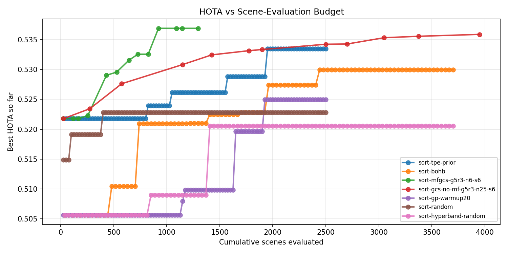
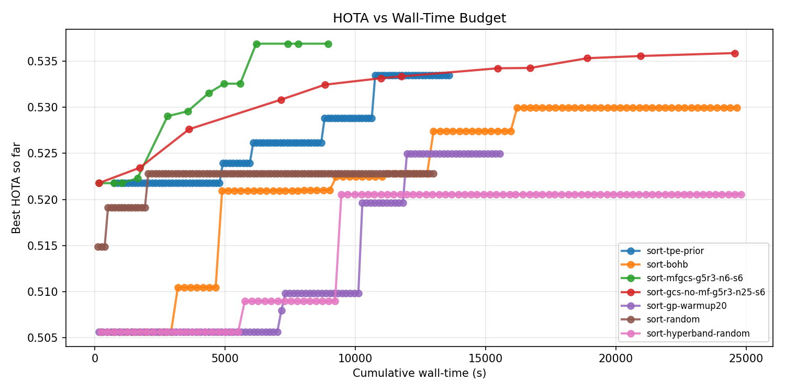
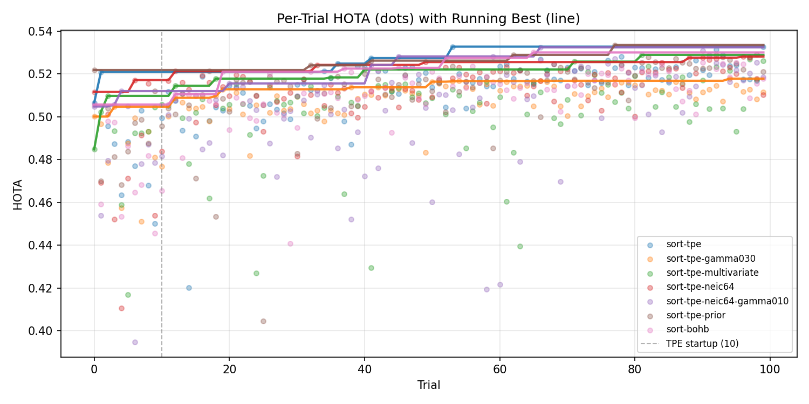
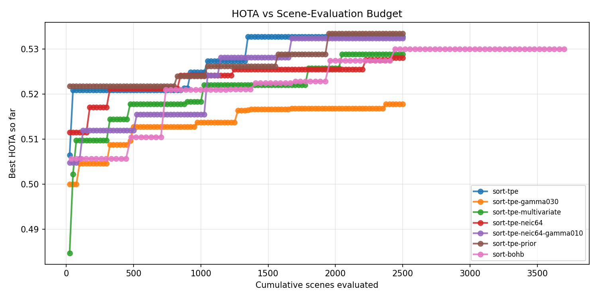
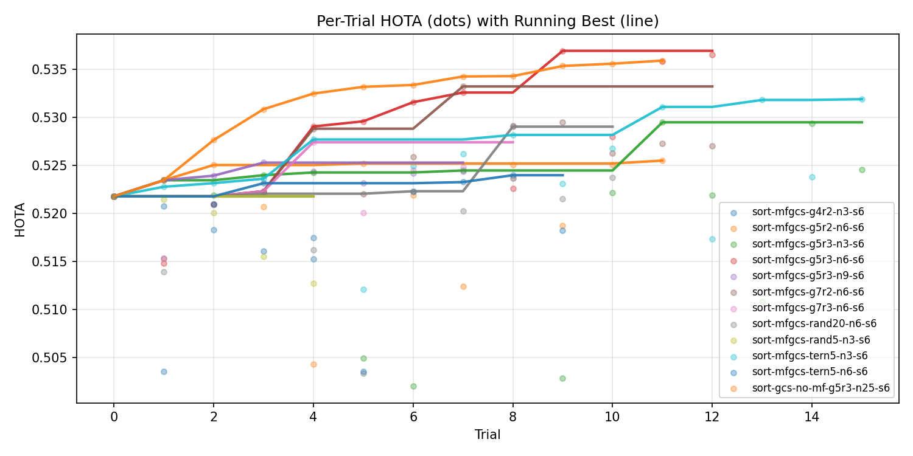
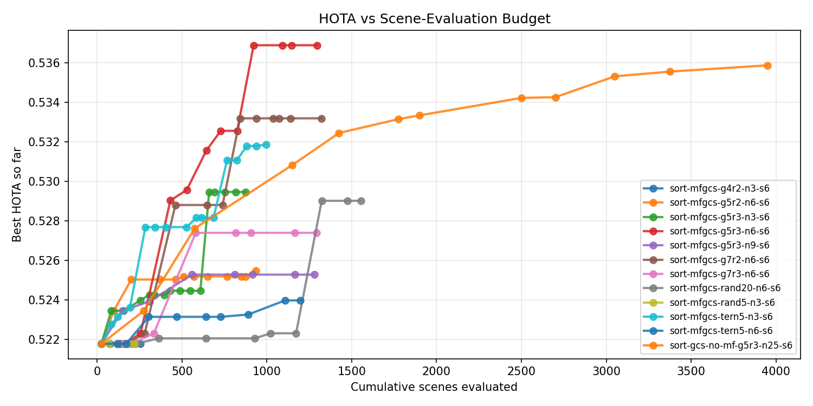
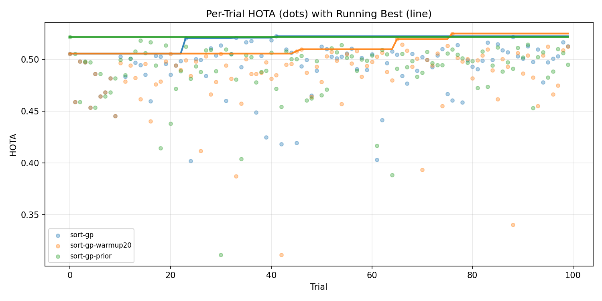
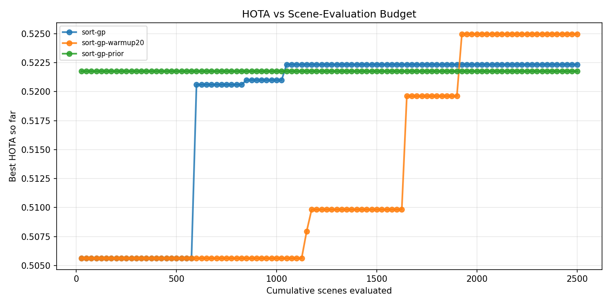
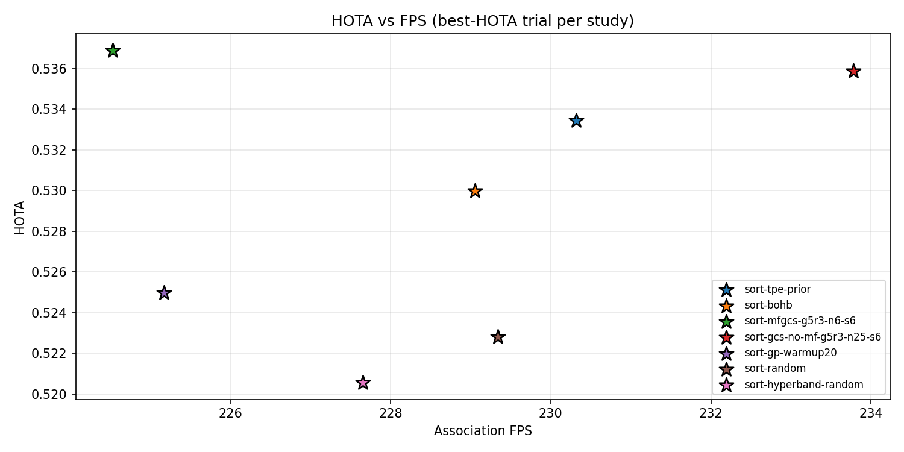

# Hyper-parameter Optimization for MOT Methods

*Part of the Computational intelligence course during PhD studies.*

## 1. Introduction

Tuning a multi-object tracker by hand is slow and unrewarding work.
A practitioner picks values for a handful of hyper-parameters
(detection thresholds, association costs, gating margins), runs the
tracker over the full validation split, inspects metrics, edits the
config, and repeats, with no guarantee that the
final point is optimal. Hyper-parameter optimization
(HPO) replaces that loop with an automated search that reaches a
measurably better configuration in a fraction of the wall-clock time.

This report runs HPO on the validation splits of
[DanceTrack](https://arxiv.org/abs/2111.14690) and
[SportsMOT](https://arxiv.org/abs/2304.05170) across four trackers:
[**SORT**](https://arxiv.org/abs/1602.00763),
[**ByteTrack**](https://arxiv.org/abs/2110.06864),
[**SparseTrack**](https://arxiv.org/abs/2306.05238), and
[**MoveSORT-KF**](https://arxiv.org/pdf/2402.09865).

Two HPO methods, selected as the best variants for this task are:

- **TPE**: [Optuna](https://optuna.org/)'s
  [Tree-structured Parzen Estimator (TPE)](https://arxiv.org/abs/1206.2944),
  the standard Bayesian HPO algorithm.
- **MFGCS**: *Multi-Fidelity Greedy Coordinate Search (MFGCS)*,
  proposed in this report. It tunes one parameter at a time, using a
  small subset of scenes to cheaply prune candidates before paying
  for a full-dataset evaluation.

Trackers are compared against the paper-published and manually-tuned baselines, with
a deeper algorithm study additionally benchmarking MFGCS against
TPE, Random, GP-BO (Gaussian Process Bayesian Optimization), and
Hyperband / BOHB (Bayesian Optimization with Hyperband). Across all eight (tracker,
dataset) combinations, both (TPE and MFGCS) HPO methods clear every available baseline.
MFGCS additionally reaches the per-tracker HOTA (Higher Order Tracking Accuracy) target faster than
TPE on 7 of 8 combinations with up to ~2 times lower optimization budget.

---

## 2. MOT Background

In this section, we summarize the domain context used throughout the
rest of the report. We cover the datasets (§2.1), the trackers we
tune (§2.2), and the multi-object tracking (MOT) metrics we report
(§2.3).

### 2.1 Datasets

- [DanceTrack](https://arxiv.org/abs/2111.14690): group dance scenes
  with similar appearance and complex non-linear motion. Val split:
  **25 scenes**.
- [SportsMOT](https://arxiv.org/abs/2304.05170): multi-sport sequences
  (basketball, football, volleyball) with fast camera motion. Val
  split: **45 scenes**.

### 2.2 Trackers

- [**SORT**](https://arxiv.org/abs/1602.00763): the pioneering
  tracking-by-detection method, which established the template every
  tracker below builds on. Predicts each track's next bounding box with
  a per-track Kalman filter (KF) on the box state and assigns
  detections to tracks via Hungarian matching on Intersection over
  Union (IoU). Fast, online, and detection-quality limited.
- [**ByteTrack**](https://arxiv.org/abs/2110.06864): extends SORT by
  splitting detections into high-score and low-score tiers and running
  two matching passes. The low-score pass recovers occluded/short-lived
  tracks that a single confidence threshold would discard, which lifts
  association quality without changing the detector.
- [**SparseTrack**](https://arxiv.org/abs/2306.05238): augments
  ByteTrack-style two-stage matching with **pseudo-depth** binning of
  detections (by box bottom-y or area). Matching happens stratum by
  stratum from near to far, which untangles crowded same-appearance
  scenes where IoU alone confuses overlapping targets.
- [**MoveSORT-KF**](https://arxiv.org/abs/2402.09865): a SORT variant
  that swaps the original constant-velocity Kalman filter for the
  Bot-SORT KF (camera-motion compensated, wider state) and replaces the
  IoU cost with the **Move** matcher, which combines IoU with a learned
  motion-consistency term. Targets the non-linear-motion failure modes
  that vanilla SORT struggles with on DanceTrack.

### 2.3 Metrics

All [HOTA](https://arxiv.org/abs/2009.07736)-family and MOT-family numbers are defined as in the
[TrackEval reference implementation](https://arxiv.org/abs/2009.07736).

- **HOTA** (optimization objective). Higher Order Tracking Accuracy;
  the geometric mean of detection accuracy (DetA) and association
  accuracy (AssA).
- **DetA.** Detection accuracy: how well the tracker's bounding-box
  outputs match the ground-truth boxes irrespective of identity.
- **AssA.** Association accuracy: how consistently a given
  ground-truth identity is covered by a single predicted track over
  its lifetime.
- **MOTA.** Multi-Object Tracking Accuracy; combines false positives,
  false negatives, and identity switches into a single score. MOTA
  is detection-biased: false-positive (FP) and false-negative (FN)
  counts dominate the formula, so an improvement is mostly an
  improvement in detection quality.
- **IDF1.** Identity F1; the F1-score of correctly identified
  detections computed with a one-to-one global identity matching
  between predicted and ground-truth tracks. IDF1 is
  association-biased: it rewards keeping the same predicted track
  attached to one ground-truth identity over its lifetime, so an
  improvement is mostly an improvement in association quality.
- **IDSW.** Identity-switch count; the number of times a predicted
  track changes its assigned ground-truth identity between consecutive
  frames. Lower is better.
- **FPS** (association FPS). Frames per second of the tracker's
  association pipeline only, measured with the detector cache hot.

---

## 3. Methodology

### 3.1 Problem formulation

We define the HPO problem as single-objective:
`maximize  HOTA(θ; D_val), θ ∈ Θ`, where `θ` is a vector of tracker
hyper-parameters and `Θ` is a bounded search space mixing numeric
intervals (e.g. `detection_threshold ∈ [0.1, 0.9]`) and discrete sets.

HOTA metric is chosen as the optimization objective because it is the
geometric mean of DetA (detection
quality) and AssA (association quality), giving a single aggregate
that balances both the detector and the association pipeline.
Optimizing HOTA therefore implicitly optimizes the two objectives a
tracker has to satisfy, without committing to a fixed weighting
between them. The one quality dimension HOTA does not capture is throughput. FPS is
reported alongside but is not optimized: all four trackers considered
here already exceed 200 FPS on the cached-detection setup, well above
any real-time requirement, so further FPS gains have no practical
payoff. Other metrics are reported for completeness.

### 3.2 Multi-Fidelity Greedy Coordinate Search (MFGCS)

#### Motivation

MFGCS targets a setting with two practical properties:

1. Full evaluations are expensive: a single tracker trial is one
   deterministic pass over the dataset's frames, costing minutes of
   CPU/GPU time per candidate. Spending one full eval per candidate
   (as TPE / Random / GP-BO do) is wasteful when many candidates are
   clearly bad.
2. HOTA on a small scene subset is noisy. We evaluate all
   candidates within one CO call on the *same* sampled scenes (no
   resampling per candidate), which cancels the per-scene noise
   across the subset comparison.

We assume that many tracker hyper-parameters have useful
per-parameter local structure (roughly monotonic or quasi-unimodal in
HOTA when other parameters are held fixed), so one-parameter-at-a-time
search is a reasonable first cut even though parameters do interact.

The name **Multi-Fidelity Greedy Coordinate Search** captures the three
ingredients: candidate values are first ranked on a cheap scene subset
(multi-fidelity), only improving moves are kept (greedy), and one
parameter is optimized at a time (coordinate search).

#### Algorithm

We use **CO** below as shorthand for the Coordinate Optimizer (one of
the pluggable Components, defined further down):

```
Inputs: search space Θ, full dataset D, scene sampler S(·),
        Coordinate Optimizer CO(·), max sweeps T, sample size m

θ ← initial config (default)
v ← Eval(θ, D)                              # baseline full-dataset score

for sweep in 1..T:
    improved ← False
    for parameter p in θ.params:
        D_s ← S(D, m)                       # low-fidelity scene subset
        θ' ← CO(θ, p, D_s)                  # search a single coordinate
        if θ'_p == θ_p:                     # CO anchors at current value
            continue                        # no candidate beat current on subset,
                                            #   so skip the doomed full-eval
        v' ← Eval(θ', D)                    # high-fidelity acceptance gate
        if v' > v:
            θ, v ← θ', v'
            optionally shrink Θ_p around θ_p'
            improved ← True
    if not improved:
        break
return θ, v
```

The CO anchors at the current parameter value, so when no candidate
beats it on the subset the same value is returned and the expensive
full-dataset evaluation is skipped: only candidate moves that look
promising at low fidelity incur the full-eval cost. Full-dataset
evaluation is the only gate by which an update is accepted; the
sampled-scene eval is purely advisory.

#### Components

MFGCS is built from four pluggable components:

**SceneSampler.** Selects a small subset `D_s ⊂ D` of scenes for the
low-fidelity stage. A simple `RandomSceneSampler` (uniform random `m`
scenes) is used throughout this report. Candidate values for the same
parameter within one CO call are evaluated on the *same* sampled
scenes, which is what makes the comparison reliable despite per-scene
noise.

**Coordinate Optimizer (CO).** Optimizes a single hyper-parameter while the
others are held fixed and returns a candidate value for the
full-dataset gate. This report uses the **`GridCoordinateOptimizer`**
(coarse-to-fine grid search): evaluate `g` evenly-spaced points on
`[A, B]` including both endpoints, pick the best, shrink the interval
around it, and repeat for `rounds` rounds. Endpoint evaluations make
Grid robust to discrete-lattice and piecewise-constant HOTA.
Alternative variants (Ternary, Random) and a head-to-head comparison
are reported in the
[MFGCS configuration ablation](#mfgcs-configuration-ablation).

The CO handles three parameter types:

- **Float.** Grid / Ternary / Random operate on `[A, B]` as described
  above.
- **Integer.** Same mechanics, but every candidate is snapped to the
  parameter's integer lattice (`v ← low + round((v − low) / step) ·
  step`) before evaluation. Duplicates introduced by snapping are
  deduplicated so each integer value is evaluated at most once per
  round.
- **Categorical** (unordered set of levels). There is no distance
  metric, so Grid and Ternary fall back to a single enumeration pass:
  evaluate every active level once on the scene subset and return the
  best. Random samples without replacement from the active levels.

**StopCondition.** Terminates the outer loop on whichever of three
events fires first: (a) a full sweep completes with no accepted moves
(local optimum reached); (b) the `max_sweeps` cap is hit; (c) the
`max_trials` budget of full-fidelity evaluations is exhausted (the
bootstrap evaluation counts as 1).

**Search-space shrinking.** After accepting a new numeric value
`θ_p*` for parameter `p` with interval `[A, B]`, the interval is
optionally narrowed to `[θ_p* − r, θ_p* + r]` (clipped to `[A, B]`) to
focus subsequent sweeps. For integer parameters the new endpoints are
re-snapped to the lattice. For unordered categoricals shrinking is
disabled (no natural distance metric), so the active level set stays
unchanged across sweeps.

---

## 4. Experiments

### 4.1 Setup

**Hardware.** CPU: 12th Gen Intel Core i7-12700K (8P + 4E cores, 20
threads). GPU: NVIDIA GeForce RTX 3070 (8 GB VRAM, driver 560.35.05, CUDA
12.1).

**Detector.** The public YOLOX-X detectors released alongside each
dataset are used, frozen, no fine-tuning during HPO.

**Inference setup.** Detections are pre-computed once per dataset and
cached on disk; tracker trials reuse the cache, so HPO wall-time is
dominated by the association pipeline, not the detector. The caching is essential to the
experiment's feasibility: with cached detections one full inference
pass over the val split takes ~2–3 minutes, whereas re-running the
detector for every trial would push a single pass to ~1.5 hours, i.e.
roughly **30–45× slower per trial**, making 100-trial HPO runs
impractical.

**Cost measurements.** Alongside the MOT metrics defined in §2.3, each
run reports per-trial inference wall-time, total optimization
wall-time, and **time-to-target**: the cumulative wall-clock at which
the run's running-best HOTA first crosses a per-tracker target listed
in each table caption. Time-to-target captures the practically-
relevant cost of finding *a* config that beats a stated bar,
independent of how much further the optimizer pushes beyond it.

**Budget definition.** Where a "budget" axis is plotted, the unit is
**cumulative scenes evaluated**: every scene processed by the optimizer. One full DanceTrack-val pass is
`|D| = 25` scenes; an MFGCS subset step at `n=6` evaluates `6` scenes.
This is the comparable axis across single- and multi-fidelity methods,
because per-trial cost is not constant under multi-fidelity. Wall-clock
is reported as a *secondary* axis only.

### 4.2 Main results

Two HPO algorithms are run on every (tracker, dataset)
combination and compared against the paper-published validation HOTA from each
tracker's original publication:

- **TPE**: Strongest Optuna's univariate TPE sampler at default settings;
  100 trials. Exact configuration is
  listed in
  [TPE default configuration](#tpe-default-configuration).
- **MFGCS-Grid `g5r3-n6-s6`**: Defaults listed in
  [MFGCS default configuration](#mfgcs-default-configuration); the
  `g5r3-n6-s6` shorthand is the Grid setting (grid=5, rounds=3,
  subset n=6, max_sweeps=6).
- **Other baselines** are not run cross-tracker but appear in
  [§4.3](#43-ablation-studies) on the
  SORT+DanceTrack search space: uniform **Random** search,
  **TPE-prior** (warm-started with the manually-tuned config),
  **GP-BO** (three variants, all under-perform Random, see appendix),
  **Random + Hyperband** and **TPE + Hyperband (BOHB)** (both prune
  0/100 trials, subset noise dominates the rung-1 signal), and **GCS
  without multi-fidelity** (same coordinate search but every eval is
  full-dataset; matches MFGCS HOTA at `~3×` the budget). Essentially, the TPE optimizer was picked
  based on the SORT+DanceTrack results.

**Manually tuned** rows are baseline configurations set by hand (not
auto-tuned, not the original paper's published hyper-parameters) and
run on our framework. They are the floor an HPO method should clear,
so the Δ-vs-Paper column combines the manual-tuning gain with stack
differences (detector checkpoint, evaluation library version).

#### DanceTrack-val

> **Targets:** SORT 53.0, ByteTrack 53.0, SparseTrack 57.0, MoveSORT-KF 54.0.
> `-` in the column means the config never reached the target.

| Tracker        | Config           | HOTA      | Δ vs Paper | Δ vs Manual | Time-to-target |
|----------------|-----------------:|----------:|-----------:|-------------:|---------------:|
| SORT           | Paper            | 47.80     | -          | -            | -              |
|                | Manually tuned   | 51.89     | +4.09      | -            | -              |
|                | TPE              | 53.27     | +5.47      | +1.38        | 125 min        |
|                | **MFGCS**        | **53.69** | **+5.89**  | **+1.80**    | **73 min**     |
| ByteTrack      | Paper            | 47.10     | -          | -            | -              |
|                | Manually tuned    | 52.93     | +5.83      | -            | -              |
|                | TPE              | 53.64     | +6.54      | +0.71        | 78 min         |
|                | **MFGCS**        | 53.29     | +6.19      | +0.36        | **2.5 min**    |
| SparseTrack    | Paper            | 53.90     | -          | -            | -              |
|                | Manually tuned    | 54.25     | +0.35      | -            | -              |
|                | TPE              | 57.34     | +3.44      | +3.09        | 207 min        |
|                | **MFGCS**        | **58.75** | **+4.85**  | **+4.50**    | **78 min**     |
| MoveSORT-KF    | Paper            | 53.30     | -          | -            | -              |
|                | Manually tuned    | 53.09     | −0.21      | -            | -              |
|                | TPE              | 55.16     | +1.86      | +2.07        | 97 min         |
|                | **MFGCS**        | 54.75     | +1.45      | +1.66        | **19 min**     |

#### SportsMOT-val

> **Targets:** SORT 78.0, ByteTrack 78.0, SparseTrack 78.0, MoveSORT-KF 79.0.

| Tracker        | Config           | HOTA      | Δ vs Paper | Δ vs Manual | Time-to-target |
|----------------|------------------|----------:|-----------:|-------------:|---------------:|
| SORT           | Paper             | -         | -          | -            | -              |
|                | Manually tuned    | 74.91     | -          | -            | -              |
|                | **TPE**          | **79.14** | -          | **+4.23**    | 52 min         |
|                | MFGCS            | 78.36     | -          | +3.45        | **51 min**     |
| ByteTrack      | Paper             | 62.80     | -          | -            | -              |
|                | Manually tuned    | 74.91     | +12.11     | -            | -              |
|                | **TPE**          | 78.85     | +16.05     | +3.94        | **30 min**     |
|                | MFGCS            | 78.85     | +16.05     | +3.94        | 110 min        |
| SparseTrack    | Paper             | -         | -          | -            | -              |
|                | Manually tuned    | 74.91     | -          | -            | -              |
|                | **TPE**          | **78.35** | -          | **+3.44**    | 195 min        |
|                | MFGCS            | 78.20     | -          | +3.29        | **118 min**    |
| MoveSORT-KF    | Paper             | -         | -          | -            | -              |
|                | Manually tuned    | 76.99     | -          | -            | -              |
|                | TPE              | 79.67     | -          | +2.68        | 77 min         |
|                | **MFGCS**        | **80.19** | -          | **+3.20**    | **48 min**     |

#### Full metric set at the best configuration

For each `tracker × dataset × HPO method` cell above, the table below
reports the full metric panel at the **best-HOTA trial** the optimizer
selected: HOTA, the DetA / AssA HOTA-decomposition, MOTA, IDF1, IDSW,
and association FPS. All metrics are in percent except IDSW (count) and
FPS (Hz).

**DanceTrack-val.**

| Tracker | Method | HOTA | DetA | AssA | MOTA | IDF1 | IDSW | FPS |
|---|---|---:|---:|---:|---:|---:|---:|---:|
| SORT        | TPE   | 53.27 | **78.33** | 36.36 | **89.86** | 53.26 | 1669 | **227.9** |
| SORT        | MFGCS | **53.69** | 76.47 | **37.81** | 87.87 | **55.60** | **1573** | 224.5 |
| ByteTrack   | TPE   | **53.64** | 78.60 | **36.77** | 90.52 | **54.14** | 1842 | **226.9** |
| ByteTrack   | MFGCS | 53.29 | **79.08** | 36.04 | **90.66** | 53.68 | **1652** | 225.3 |
| SparseTrack | TPE   | 57.34 | 77.32 | 42.65 | 87.12 | 58.52 | 1584 | 203.1 |
| SparseTrack | MFGCS | **58.75** | **78.86** | **43.95** | **89.67** | **58.73** | **1524** | **205.9** |
| MoveSORT-KF | TPE   | **55.16** | **78.61** | **38.87** | **90.27** | **54.96** | 1559 | **216.2** |
| MoveSORT-KF | MFGCS | 54.75 | 78.06 | 38.53 | 88.72 | 54.50 | **1461** | 212.2 |

**SportsMOT-val.**

| Tracker | Method | HOTA | DetA | AssA | MOTA | IDF1 | IDSW | FPS |
|---|---|---:|---:|---:|---:|---:|---:|---:|
| SORT        | TPE   | **79.14** | 92.14 | **67.99** | 98.73 | **79.14** | **625** | **273.7** |
| SORT        | MFGCS | 78.36 | **92.38** | 66.49 | **98.80** | 77.93 | 660 | 273.3 |
| ByteTrack   | TPE   | **78.85** | **92.36** | 67.34 | 98.81 | 78.43 | 629 | 270.3 |
| ByteTrack   | MFGCS | **78.85** | 92.29 | **67.39** | **98.83** | **78.78** | **625** | **273.8** |
| SparseTrack | TPE   | **78.35** | **92.11** | **66.66** | 98.45 | **78.32** | **731** | 244.9 |
| SparseTrack | MFGCS | 78.20 | 91.98 | 66.51 | **98.53** | 78.03 | 827 | **246.2** |
| MoveSORT-KF | TPE   | 79.67 | 92.31 | 68.78 | 98.64 | 79.56 | 595 | 246.2 |
| MoveSORT-KF | MFGCS | **80.19** | **92.48** | **69.55** | **98.83** | **80.27** | **552** | **257.5** |

The DetA column is tight across methods on both datasets (the detector
is shared), so the HOTA differences between TPE and MFGCS are driven
almost entirely by AssA, the association-quality term that the tracker
hyper-parameters actually control.

The FPS column sits in a narrow 200–280 band across all 16 rows, well
above any real-time threshold for MOT, so on this search space the HPO
choice does not trade HOTA for throughput.

Three points stand out:

- **The published paper baselines are under-tuned.** Both HPO methods
  clear every paper-published HOTA by a wide margin: across the eight
  DanceTrack-val rows reported, the smallest of `Δ TPE−Paper` and
  `Δ MFGCS−Paper` is `+1.45` (MoveSORT-KF MFGCS) and the largest is
  `+6.54` (ByteTrack TPE). On SportsMOT, both methods outperform the
  manually-tuned baseline by `+3` to `+4` HOTA on every tracker.
- **Manual tuning is not worth the time.** Hand-tuning the baselines took
  anywhere from a few hours to a few days per tracker, and the result
  still sits below both HPO methods on every row of the §4.2 tables.
  HPO reaches a better config in a few hours of wall-clock (`73 min`
  for MFGCS-SORT-DanceTrack, `48 min` for MFGCS-MoveSORT-SportsMOT,
  etc.), and the gap widens once the time spent inspecting trial
  outputs and re-running is counted. We keep the manually-tuned row
  as a *floor* (the bar any HPO method must clear to justify the
  budget) rather than a competitive baseline. Running MFGCS once is
  cheaper than continuing to hand-tune.
- **MFGCS reaches the per-tracker target faster than TPE on 7 of 8
  cells.** On DanceTrack the time-to-target ratios are MFGCS/TPE =
  `73/125 = 58%` (SORT), `2.5/78 = 3%` (ByteTrack, MFGCS's
  bootstrap-eval already cleared the bar), `78/207 = 38%`
  (SparseTrack), and `19/97 = 20%` (MoveSORT). On SportsMOT they are
  `51/52 ≈ 98%` (SORT, near tie), `110/30 = 367%` (ByteTrack, the
  only cell where TPE wins on time-to-target), `118/195 = 61%`
  (SparseTrack), and `48/77 = 62%` (MoveSORT). TPE wins
  time-to-target on ByteTrack-SportsMOT only, the cell where the
  manually-tuned starting config already nearly clears the bar so
  TPE's wider initial sampling gets there first.

> **Single-seed limitation.** Every cell is one seed (=42). The
> cross-seed standard error for tracker-eval HOTA on these splits is
> roughly `σ_d / √|D| ≈ 0.008` in normalised HOTA, i.e. about `±0.8`
> HOTA points on the percent scale used in the tables above
> (DanceTrack, 25 scenes; `σ_d ≈ 0.04` is the per-scene HOTA SD).
> Small `Δ` columns (|Δ| ≲ `1` HOTA point) should therefore be read
> as ties.

### 4.3 Ablation studies

This section collects the experiments that justify the §4.2 algorithm
choices, run on a single search space (SORT / DanceTrack-val) so that
every result is directly comparable. We use it for two purposes:

1. Picking the MFGCS configuration carried into §4.2. We sweep the
   coordinate optimizer (Grid / Ternary / Random), grid resolution
   `g`, number of rounds `r`, subset size `n`, and max sweeps `s`;
   the winning combination `g5r3-n6-s6` is the one §4.2 reports
   across all four trackers.
2. Picking the strongest classical HPO baseline for the head-to-head
   against MFGCS. We run Random, TPE (vanilla and prior-warm-started),
   GP-BO, and Hyperband / BOHB at the same trial budget, and the
   sub-variant ablations explain why TPE is the right comparison
   rather than e.g. TPE-prior or any GP-BO variant.

The accompanying figures plot running-best HOTA against cumulative
scenes evaluated (the budget axis defined in §4.1).

**Studies compared, by family.**

| Family                  | Studies                                                                                  |
|-------------------------|-------------------------------------------------------------------------------------------|
| Random                  | `sort-random` (Optuna `RandomSampler(seed=42)`)                                          |
| TPE                     | `sort-tpe` (vanilla), `sort-tpe-prior` (warm-start). Sub-variant ablation in [TPE configuration ablation](#tpe-configuration-ablation) |
| GP-BO                   | Three configs ablated in [GP-BO configuration ablation](#gp-bo-configuration-ablation); negative result, summarized here only. |
| Multi-fidelity Hyperband | `sort-hyperband-random` (Random+HB), `sort-bohb` (TPE+HB)                                |
| Multi-fidelity MFGCS    | `sort-mfgcs-g5r3-n6-s6` (Grid, §4.3 winner), `sort-mfgcs-tern5-n3-s6` (Ternary), `sort-mfgcs-rand20-n6-s6` (Random) |
| Coord-greedy (no MF)    | `sort-gcs-no-mf-g5r3-n25-s6`, same coord-search but every eval is full-dataset           |

**Best HOTA and budget per study, classical baselines vs. MFGCS
coord variants.** Each row reports the running-best HOTA reached
within a `N=100` trial budget, alongside the cumulative scenes
evaluated and total wall-clock spent to get there. Classical single-
fidelity samplers (Random, TPE) burn the full per-trial cost on every
candidate; the MFGCS rows reach comparable or higher HOTA at roughly
half the scene budget by gating most evaluations on a scene subset
before paying the full-dataset eval.

| Study                              | Family / variant                | Best HOTA  | Trials | Total scenes | Total wall-time |
|------------------------------------|---------------------------------|-----------:|-------:|-------------:|----------------:|
| `sort-random`                      | Random                          | 0.5228     | 100    | 2500         | ~258 min        |
| `sort-tpe`                         | TPE (vanilla)                   | 0.5327     | 100    | 2500         | ~258 min        |
| `sort-tpe-prior`                   | TPE + prior                     | 0.5335     | 100    | 2500         | ~258 min        |
| `sort-mfgcs-tern5-n3-s6`           | MFGCS Ternary                   | 0.5319     | 16     | 997          | 125 min         |
| `sort-mfgcs-rand20-n6-s6`          | MFGCS Random                    | 0.5290     | 20     | 1553         | 182 min         |
| **`sort-mfgcs-g5r3-n6-s6`**        | **MFGCS Grid (§4.3 winner)**    | **0.5369** | **17** | **1297**     | **149 min**     |

**MFGCS coord-variant winner.** Grid `g5r3-n6-s6` (HOTA `0.5369`) > Ternary
`tern5-n3-s6` (`0.5319`) > Random `rand20-n6-s6` (`0.5290`). Grid is more
robust to MOT's piecewise-constant noise because its per-coord candidate set
includes the interval endpoints (where many discrete-lattice / categorical
optima sit); Ternary's interior-only sectioning misses those. See the
[Ternary vs Grid comparison](#ternary-vs-grid-relationship-and-trade-offs)
for a formal theoretical comparison.

GP-BO, Hyperband / BOHB, and a coord-greedy-without-multi-fidelity
ablation were also run on this search space but did not justify being
carried into §4.2. Their tables and commentary are in the
[Negative-result baselines](#negative-result-baselines) appendix
section; their running-best curves are included in the plots below
for visual comparison.

**Running-best HOTA per family** (Random, TPE / TPE-prior,
MFGCS-Grid, BOHB, GCS-no-MF), plotted against cumulative scenes
evaluated (top) and wall-clock (bottom). MFGCS-Grid sits in the
upper-left of both views: it reaches and exceeds the winning HOTA at
lower scene counts than any single-fidelity competitor, and the lead
carries over to wall-clock once subset evals are converted to time.





FPS for the §4.2 algorithms is already covered by the full-metric
tables in [§4.2](#full-metric-set-at-the-best-configuration); a
scatter view across all §4.3 families is in the
[HOTA vs FPS across families](#hota-vs-fps-across-families)
appendix subsection.

---

## 5. Conclusion

- The published paper baselines for these trackers are under-tuned.
  Both TPE and MFGCS clear every paper-published HOTA by a wide
  margin on every (tracker, dataset) cell where a paper number
  exists. The smallest gap is `+1.45` HOTA (MoveSORT-KF MFGCS on
  DanceTrack) and the largest is `+6.54` (ByteTrack TPE on
  DanceTrack). A gap of that size is too big to be explained by stack
  differences alone.
- Manual tuning is not worth the time. Multi-hour to multi-day
  hand-tuning still sits below both HPO methods on every row, while
  MFGCS reaches a better configuration in well under two hours
  (`73 min` for SORT-DanceTrack, `48 min` for MoveSORT-SportsMOT).
  Running MFGCS once is cheaper than continuing to hand-tune.
- MFGCS is more budget-efficient than TPE on this benchmark; TPE is
  a safer fallback when the starting point is already near-optimal.
  MFGCS reaches the per-tracker target faster than TPE on 7 of 8
  cells with both numbers populated, at comparable or better final
  HOTA. The single cell where TPE wins on time-to-target is the one
  where the manually-tuned starting config already nearly clears the
  bar, so TPE's wider initial sampling gets there first.

---

## Appendix

### Additional discussion

Theoretical / methodological notes that support the ablation findings
below but are not themselves experiments.

#### Ternary vs Grid: relationship and trade-offs

`TernaryCoordinateOptimizer` and `GridCoordinateOptimizer` are both 1-D
contractive search methods, but they are *not* equivalent and Ternary is
not a special case of Grid for any choice of `grid` / `rounds`. The
differences matter when the two are interchanged in §4.3 (algorithm comparison) and the [MFGCS ablation](#mfgcs-configuration-ablation).

##### Where each method evaluates

For window `[A, B]` with width `w = B − A`:

| Method | Per-step / per-round eval points | Count |
|--------|-----------------------------------|-------|
| **Ternary** | `m1 = A + w/3`, `m2 = B − w/3` (no endpoints) | 2 |
| **Grid `g=3`** | `{A, A + w/2, B}` | 3 |
| **Grid `g=4`** | `{A, A + w/3, A + 2w/3, B}` | 4 |
| **Grid `g`** | `g` evenly-spaced points including both endpoints | g |

`Grid g=4` evaluates Ternary's `m1`, `m2` *plus* the two endpoints. Grid
never matches Ternary's eval set exactly because Grid always includes
endpoints; Ternary never does (its final-midpoint check is a separate
post-loop step).

##### How each method shrinks the window

| Method | Shrink rule | New width |
|--------|-------------|-----------|
| **Ternary** | Drop the third on the opposite side of the better midpoint | always `⅔·w`, regardless of where best lies |
| **Grid `g`** | Recenter on the best point: `[best − step, best + step]`, `step = w/(g−1)` | `2·w/(g−1)` if best is interior; `w/(g−1)` if best is at an endpoint (clipped) |

For `g=4` (the closest Grid analogue):
- Best interior → new width = `⅔·w` (same rate as Ternary)
- Best at endpoint → new width = `⅓·w` (faster than Ternary)
- Convergence per round is at least as fast as Ternary, often better

##### Eval cost per unit contraction

| Method | Evals per step / round | Width-shrink factor | Evals to halve the window |
|--------|--------------------------:|----------------------|---------------------------:|
| Ternary | 2 | 2/3 | `≈ 2 · log_{3/2}(2) ≈ 3.4` |
| Grid `g=4` (interior) | 4 | 2/3 | `≈ 4 · log_{3/2}(2) ≈ 6.8` |
| Grid `g=4` (endpoint) | 4 | 1/3 | `≈ 4 · log_{3}(2) ≈ 2.5` |

**Ternary is roughly 2× cheaper per round than Grid `g=4` for the same
contraction rate**, *when the optimum is interior and the function is
strictly unimodal*. Grid recovers parity (or wins) when the optimum lies
near an endpoint or the function is multi-modal.

##### Practical implications for MFGCS coord-search

| Coord type | Better choice | Why |
|------------|---------------|-----|
| Smooth, unimodal float (e.g. detection threshold) | Ternary | Cheaper per round at the same contraction rate. |
| Noisy / discrete-lattice / piecewise-constant float | Grid (g≥4) | Endpoint evals catch corner optima Ternary's interior-only sectioning would miss. |
| Integer | Grid (g=4 fallback) | Ternary's `m1`/`m2` round to the same lattice point on small ranges; Grid's quantized lattice is reliable. |
| Categorical | Random / `_pick_best` | No distance metric, Grid and Ternary both fall back. |

However, the §4.3 algorithm comparison shows Grid `g5r3-n6` *beats* Ternary
`tern5-n3` (HOTA `0.5369` vs `0.5319`) on the SORT search space's
post-tweak run. The Ternary 2× cost advantage from interior-only sectioning
is outweighed by Grid's robustness to discrete-lattice / piecewise-constant
HOTA, which catches corner optima Ternary misses.

### Additional ablations

Per-family parameter sweeps on the SORT / DanceTrack-val search space, used
to justify the §4.2 algorithm choices. All variants run with the same
trial budget `N=100`, identical search space, and seed `42` unless
noted. Within an ablation, HOTA differences below `~0.005` should be
read as ties: roughly the empirical cross-seed band on this benchmark.

#### TPE configuration ablation

Optuna's [Tree-structured Parzen Estimator](https://arxiv.org/abs/1206.2944)
is a Bayesian-style sampler that maintains two density estimates of
the search space (the top-`γ` "good" configurations vs the rest) and
proposes the next trial by maximizing the ratio between them. The
ablation below sweeps the sampler's own meta-parameters; results are
sorted by HOTA.

| Config                          | Sampler                              | Best HOTA   | Wall-time |
|---------------------------------|--------------------------------------|------------:|----------:|
| `tpe_sort_gamma030`             | TPE, γ=0.30                          | 0.5177      | ~258 min  |
| `tpe_sort_neic64`               | TPE, n_ei_candidates=64              | 0.5281      | ~258 min  |
| `tpe_sort_multivariate`         | TPE, multivariate=true               | 0.5288      | ~258 min  |
| `tpe_sort_neic64_gamma010`      | TPE, γ=0.10, n_ei_candidates=64      | 0.5324      | ~258 min  |
| `tpe_sort`                      | TPE (vanilla, γ=0.20, n_ei=24)       | 0.5327      | ~258 min  |
| **`tpe-prior_sort`**            | warm_tpe (manually-tuned seed)       | **0.5335**  | ~258 min  |

<p align="center">
  
  
</p>

**Running-best HOTA per TPE variant** (left) and HOTA vs cumulative
scenes evaluated (right) for the same studies, plus the BOHB
TPE+HyperbandPruner variant.

Reading differences below the `~0.005` noise band as ties, two
observations come out:

- Only `γ=0.30` underperforms materially: `tpe_sort_gamma030` loses
  `~0.015` HOTA vs vanilla (`0.5177` vs `0.5327`), well outside the
  noise band. Increasing the good/bad split quantile blurs the
  density-ratio signal that drives TPE's acquisition.
- Every other variant is tied with vanilla. Raising `n_ei_candidates`
  to `64` (`-0.0046`), enabling the multivariate kernel (`-0.0039`),
  the `n_ei=64, γ=0.10` combination (`-0.0003`), and the
  prior-warm-started variant (`+0.0008`) all sit within the noise
  band of the default `(γ=0.20, n_ei_candidates=24)`. Practical
  takeaway: Optuna's defaults are good enough, and the prior gives
  no measurable improvement when a hand-tuned config is not part of
  the §4.2 baseline set. This is the cross-tracker rationale in §4.2
  for picking vanilla TPE over TPE-prior.

#### MFGCS configuration ablation

MFGCS is the coordinate-wise greedy search introduced in
[§3.2](#32-multi-fidelity-greedy-coordinate-search-mfgcs): cheap
scene-subset evaluations filter candidates per coordinate before a
full-dataset gate accepts each move. The ablation sweeps MFGCS's
coordinate-search and subset-sampling parameters on the canonical
post-tweak algorithm (anchor + `accept_threshold=1e-4` +
`drop_after_barren_sweeps=2`).
Coord-variant defaults to `grid`; suffix `g{N}r{R}-n{S}-s{T}` reads
as: grid points per coord (`g`), rounds per coord (`r`), subset
scenes (`n`), max sweeps (`s`). Other prefixes: `tern{N}` = Ternary
with `N`-step contraction; `rand{M}` = Random with `M` candidates per
coord. Results sorted by HOTA.

| Config                          | HOTA      | Scenes  | Wall     | Note |
|---------------------------------|----------:|--------:|---------:|------|
| `sort-mfgcs-g4r2-n3-s6`         | 0.5218    | 254     | 31 min   | grid `g=4` too coarse, fails to escape manually-tuned starting config |
| `sort-mfgcs-rand5-n3-s6`        | 0.5218    | 221     | 26 min   | random `M=5` candidates per coord, also stuck at starting config |
| `sort-mfgcs-tern5-n6-s6`        | 0.5240    | 1198    | 141 min  | Ternary with `n=6`, subset-noise reduction *hurts* Ternary (opposite of Grid) |
| `sort-mfgcs-g5r2-n6-s6`         | 0.5255    | 911     | 102 min  | `r=2` worse than `r=3` (loss `0.011` HOTA vs. winner) |
| `sort-mfgcs-g7r3-n6-s6`         | 0.5274    | 1293    | 147 min  | over-shrinking; resolution past `g=5` hurts |
| `sort-mfgcs-rand20-n6-s6`       | 0.5290    | 1553    | 182 min  | `M=20` random candidates, finally produces real improvement at higher candidate count |
| `sort-mfgcs-g5r3-n3-s6`         | 0.5295    | 874     | 107 min  | `g=5, r=3` but subset `n=3`, slightly noisy at small subset |
| `sort-mfgcs-tern5-n3-s6`        | 0.5319    | 997     | 125 min  | Ternary with `n=3`, sweet spot for Ternary variant |
| `sort-mfgcs-g7r2-n6-s6`         | 0.5332    | 1321    | 155 min  | wider lattice ≯ deeper rounds |
| `sort-mfgcs-g5r3-n9-s6`         | 0.5333    | 1280    | 137 min  | `n=9` ≯ `n=6` once subset-noise is below the win-margin |
| **`sort-mfgcs-g5r3-n6-s6`**     | **0.5369**| **1297**| **149 min** | ⭐ **winner**: `g=5, r=3, n=6, s=6`; all post-tweak options on |

<p align="center">
  
  
</p>

**Running-best HOTA across MFGCS variants** (left) and HOTA vs
cumulative scenes evaluated (right), for every canonical post-tweak
study plus GCS-no-MF for reference.

From the MFGCS sweep:

- Subset-size sweet spot differs by coord variant: **`n=6` for Grid,
  `n=3` for Ternary**. Above the sweet spot, the subset starts losing
  the variance-reduction benefit and trades off against the budget
  cost.
- Grid resolution `g≥5` is needed to escape the manually-tuned
  starting config; `g=3` and `g=4` are too coarse for this 7-dim
  mixed-type space (the lattice re-quantizes the optimum to the same
  grid point as the starting config).
- Round count `r=3 > r=2` (`g5r2-n6` lost `0.011` HOTA vs. `g5r3-n6`).
- Subset noise (`σ_d ≈ 0.04` per-scene paired HOTA SD, estimated
  empirically across these runs) sets the floor on `accept_threshold`;
  tightening below `~σ_d / √n` would over-reject.

#### GP-BO configuration ablation

GP-BO models the HOTA landscape with a Gaussian-process surrogate
and picks the next trial by maximizing expected improvement under the
posterior. The ablation sweeps Optuna's experimental `GPSampler`;
results sorted by HOTA.

| Config                       | Sampler                                            | Best HOTA  | Trials | Total scenes | Wall-time |
|------------------------------|----------------------------------------------------|-----------:|-------:|-------------:|----------:|
| `sort-gp-prior`              | `warm_gp`, manually-tuned config seeded as trial 0 | 0.5218     | 100    | 2500         | 259 min   |
| `sort-gp`                    | `GPSampler(n_startup_trials=10)`                   | 0.5223     | 100    | 2500         | 259 min   |
| `sort-gp-warmup20`           | `GPSampler(n_startup_trials=20)`                   | 0.5250     | 100    | 2500         | 259 min   |

<p align="center">
  
  
</p>

**Running-best HOTA per GP-BO variant** (left) and HOTA vs cumulative
scenes evaluated (right).

On this search space, GP-BO behaves as follows:

- All three GP configurations sit at or *below* uniform Random's
  `0.5228`, i.e. Optuna's experimental `GPSampler` underperforms the
  cheapest unbiased baseline on the SORT search space. The
  longer-warmup variant edges Random by a small margin (`+0.0022`);
  the default and prior-seeded variants tie or lose.
- The `sort-gp-prior` failure mode is the most diagnostic: with the
  manually-tuned config seeded at trial 0, the GP has 99 further
  trials to explore but never produces a *better* candidate, its
  final HOTA equals the trial-0 score (`0.5218`).
- **Why GP fails here.** The SORT search space mixes continuous
  floats (`detection_threshold`, `match_threshold`, etc.), integers
  (`initialization_threshold`, `remember_threshold`), and one
  categorical (`fuse_score`). Optuna's default `GPSampler` kernel
  does not natively handle categorical inputs (it one-hot encodes
  them, which inflates the effective dimensionality and hurts the
  GP's kernel-distance computations). A BoTorch-backed GP with a
  categorical kernel + ARD (Automatic Relevance Determination) would
  likely fare better but was out of scope for this report.

### Additional results

Supplementary numerical / figure results restricted to the
SORT / DanceTrack-val search space (the deeper-dive setting from §4.3).

#### HOTA vs FPS across families

Family-level HOTA vs association FPS for the §4.3 ablation studies:
one star per study, plotted at the best-HOTA trial. All seven studies
cluster in a narrow FPS band well above any real-time threshold,
confirming that the HPO choice does not trade HOTA for throughput on
this search space.



#### Negative-result baselines

These HPO methods were run on the SORT / DanceTrack-val search space
but did not justify being carried into §4.2. They are documented here
for completeness: GP-BO and Hyperband / BOHB as classical alternatives
that under-perform the simple baselines on this problem, and
**GCS-without-multi-fidelity** as the controlled ablation that isolates
the multi-fidelity contribution from the coordinate-greedy contribution.

GP-BO baselines (3 configs, all sit at or below uniform Random) are
tabulated in the
[GP-BO configuration ablation](#gp-bo-configuration-ablation);
the remaining studies are:

| Study                              | Algorithm                       | Best HOTA  | Trials | Total scenes | Total wall-time | Note |
|------------------------------------|---------------------------------|-----------:|-------:|-------------:|----------------:|------|
| `sort-hyperband-random`            | Random + HyperbandPruner        | 0.5206     | 100    | 3700         | 413 min         | 0/100 trials pruned |
| `sort-bohb`                        | TPE + HyperbandPruner (BOHB)    | 0.5300     | 100    | 3700         | 411 min         | 0/100 trials pruned |
| `sort-gcs-no-mf-g5r3-n25-s6`       | GCS without multi-fidelity      | 0.5359     | 12     | 3950         | 409 min         | matches MFGCS-Grid HOTA at `~3×` cost |

**Commentary.**
- *GP-BO family* (3 configs ablated in the
  [GP-BO configuration ablation](#gp-bo-configuration-ablation)):
  all three sit at or below uniform Random's `0.5228`. Optuna's
  experimental `GPSampler` with the default kernel handles the SORT
  search space's mixed continuous / integer / categorical structure
  poorly. A BoTorch-backed GP with a categorical kernel + ARD might
  fare better but was out of scope.
- *Hyperband family* (Random+HB, TPE+HB / BOHB): both pruned `0/100`
  trials. The percentile prune rule cannot reliably distinguish bad
  trials from noisy ones at low fidelity because subset noise
  (`σ_d ≈ 0.04` per-scene paired HOTA SD) dominates the rung-1 signal.
  The methods degenerate into "vanilla sampler with `1.48×` extra cost"
  and lose `−0.0022` (Random) / `−0.0027` (TPE) HOTA relative to their
  non-Hyperband counterparts.
- *GCS without multi-fidelity* (full-eval gate everywhere, no scene
  subsampling): reaches HOTA `0.5359` (within `0.001` of MFGCS-Grid's
  `0.5369`) but consumes `3950` cumulative scenes vs. MFGCS's `1297`.
  Demonstrates that the multi-fidelity scene-subset stage cuts
  cumulative scenes by `~3×` at a `~0.001` HOTA cost, isolating the
  contribution of the multi-fidelity claim from the coordinate-greedy
  claim.

### Default configurations

Parameter settings used by the algorithms carried into §4.2 unless
noted otherwise. Sub-variants are covered in the ablations above.

#### MFGCS default configuration

Defaults used throughout this report unless noted otherwise.

| Parameter                     | Default          | Purpose |
|-------------------------------|------------------|---------|
| `coordinate_optimizer`        | `grid`           | Coarse-to-fine grid search per coordinate. |
| `grid`                        | `5`              | Grid points per round (incl. both endpoints). |
| `rounds`                      | `3`              | Coarse-to-fine rounds per coordinate. |
| `scene_sampler`               | `random`         | `RandomSceneSampler`. |
| `n` (subset size)             | `6`              | Scenes drawn per coordinate at low fidelity. |
| `max_sweeps`                  | `6`              | Outer-loop cap. |
| `max_trials`                  | `100`            | Hard cap on full-fidelity evaluations. |
| `early_stop`                  | `true`           | Stop after a sweep with no accepted moves. |
| `accept_threshold`            | `1e-4`           | Min HOTA gain over running-best to accept (≈ noise floor `σ_d / √n`). |
| `drop_after_barren_sweeps`    | `2`              | Drop a parameter after this many consecutive sweeps without an accept. |
| `radius_frac` (shrink)        | `0.25`           | Half-width of post-accept interval shrink, as a fraction of the current width. |
| `bootstrap_full_eval`         | `true`           | Run one full-dataset eval on the initial config to seed `v`. |

This is the `g5r3-n6-s6` setting referenced in the main results.

#### TPE default configuration

Default TPE sampler used in §4.2 and §4.3.

| Parameter         | Default | Notes |
|-------------------|---------|-------|
| Sampler           | `TPESampler` (Optuna) | Univariate (default kernel). |
| `γ`               | `0.20`  | Quantile split for the good/bad density estimates. |
| `n_ei_candidates` | `24`    | Candidates drawn per step for EI maximization. |
| `seed`            | `42`    | Same seed across all TPE / Random / MFGCS runs. |
| `n_trials`        | `100`   | Trial budget; each trial is one full-dataset evaluation. |

Sub-variants (multivariate kernel, prior-warm-started `warm_tpe`,
alternate `γ` and `n_ei_candidates` settings) are ablated in the
[TPE configuration ablation](#tpe-configuration-ablation) above.
